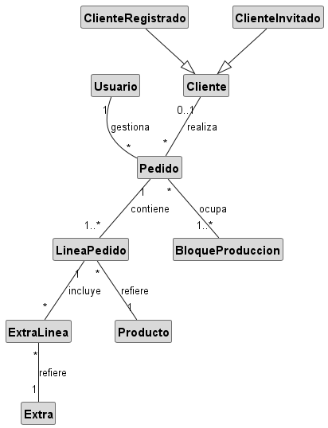
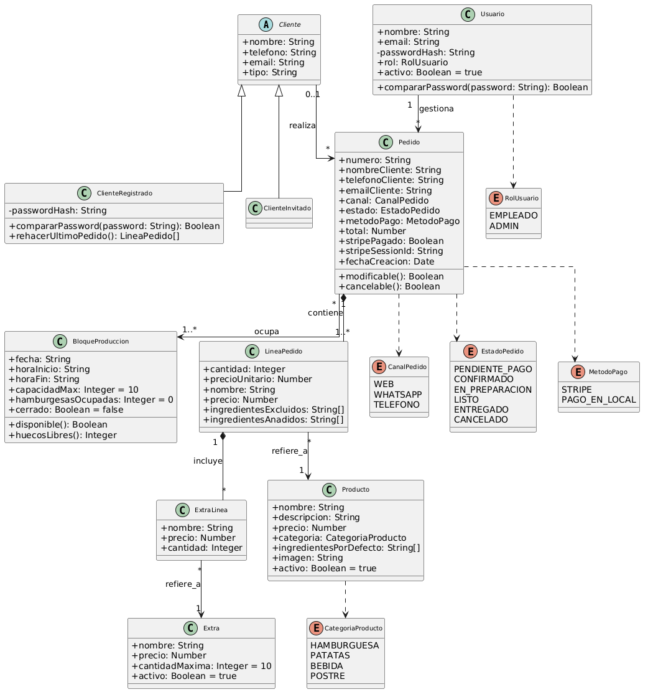
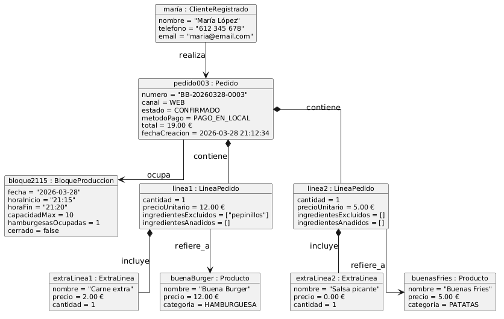
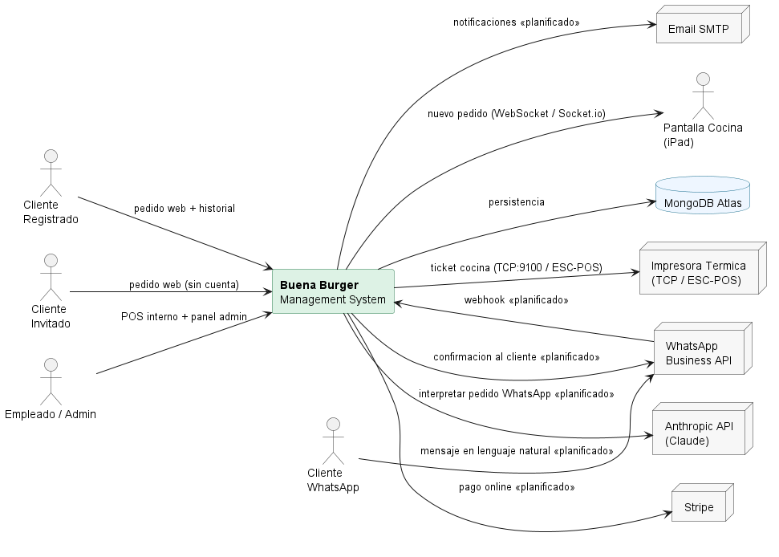
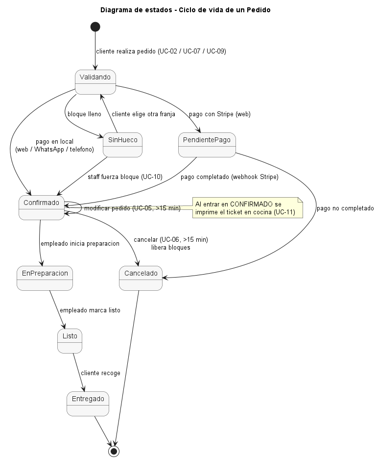
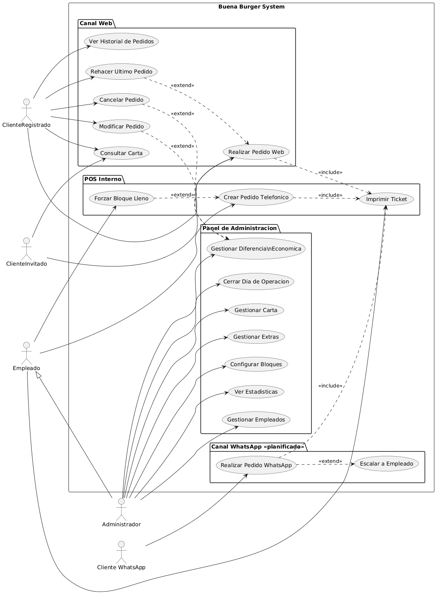

# Capítulo 2 — Disciplina de requisitos

[◄ Volver al README principal](../README.md) · [Memoria completa del capítulo](../docs/capitulos/capitulo2.md)

> **Disciplina:** análisis del problema. **Punto de partida de todo el proceso.**
> **Qué se muestra aquí:** del vocabulario del negocio (modelo del dominio) salen los requisitos; de los requisitos, los casos de uso; y de ahí, todo el diseño del Capítulo 3.

**Recorrido del capítulo:** [1. Modelo del dominio](#1-modelo-del-dominio) → [2. Requisitos](#2-requisitos) → [3. Diagrama de contexto](#3-diagrama-de-contexto) → [4. Casos de uso](#4-casos-de-uso)

---

## 1. Modelo del dominio

El modelo del dominio captura los **conceptos puros del negocio**, sin decisión tecnológica alguna. Es el punto de partida: de él derivan los requisitos y, más adelante, los modelos de datos (Cap. 3) y las clases del código (`src/models/`).

Versión detallada con atributos, tipos y operaciones (diagrama de clases):

**Diagrama de objetos** — una instancia concreta del modelo (pedido real de María López: bloque 21:15, 1× Buena Burger sin pepinillos + carne extra, 1× Buenas Fries con salsa picante, total 19,00 €):

📄 **Construcción razonada del modelo (sustantivos → entidades → relaciones):** [`modeloDelDominio.md`](../docs/modeloDelDominio.md) · versión interactiva: [`01-dominio.html`](../docs/diagramas/capitulo2/01-dominio.html)

### Entidades del dominio

| Entidad | Concepto del negocio |
|---|---|
| **Cliente** *(abstracta)* | Quien realiza un pedido. Se especializa en `ClienteRegistrado` (con cuenta e historial) y `ClienteInvitado` (sin cuenta). |
| **Pedido** | Entidad central. Una orden para recoger en el local, con canal, estado, método de pago y total. |
| **LíneaPedido** | Cada artículo del pedido, con cantidad, precio y personalización (ingredientes excluidos/añadidos). |
| **ExtraLínea** | Extra concreto añadido a una línea, con su cantidad. |
| **Producto** | Ítem del catálogo (hamburguesa, patatas, bebida, postre). |
| **Extra** | Ingrediente adicional con precio y límite, aplicable solo a hamburguesas y patatas. |
| **BloqueProducción** | Franja de 5 min con capacidad de 10 hamburguesas. Regula el ritmo de cocina. |
| **Usuario** | Personal interno (empleado/admin) con acceso al TPV y al panel. Concepto **separado** de `Cliente`. |

### Relaciones clave

| Relación | Tipo | Lectura |
|---|---|---|
| `Pedido ◆— LíneaPedido` | Composición 1 → 1..* | Un pedido tiene al menos una línea; no existen sin él |
| `Pedido — BloqueProducción` | Asociación * → 1..* | Un pedido puede ocupar varios bloques consecutivos |
| `LíneaPedido — Producto` | Asociación * → 1 | Muchas líneas referencian el mismo producto |
| `LíneaPedido ◆— ExtraLínea` | Composición 1 → * | Una línea puede llevar varios extras |
| `Cliente — Pedido` | Asociación 0..1 → * | Un pedido puede no tener cliente (invitado) |

### Glosario del dominio (extracto)

| Término | Definición |
|---|---|
| **Bloque de producción** | Franja de 5 min; máximo 10 hamburguesas. |
| **Forzar bloque** | Acción exclusiva del staff: crear un pedido en un bloque ya completo. |
| **Noche operativa** | Viernes, sábado o domingo de 20:30 a 23:00. |
| **Rehacer pedido** | Cargar en el carrito las líneas del último pedido (solo cliente registrado). |
| **Ticket** | Documento impreso en cocina al confirmar un pedido. |

Glosario completo (14 términos) en la [memoria §2.1.3](../docs/capitulos/capitulo2.md#213-glosario-del-dominio).

> **Decisiones de modelado defendibles:** separar `Cliente` de `Usuario` (contextos y permisos distintos); `Extra` como entidad (tiene precio y límite, no texto libre); excluir `Ticket` como entidad (es una vista del `Pedido`).

---

## 2. Requisitos

Los requisitos transforman los conceptos del dominio en **comportamientos del sistema**, sin contaminación de implementación.

### 2.1 Requisitos no funcionales (requisitos suplementarios)

| Código | Tipo | Descripción |
|---|---|---|
| RS-01 | Rendimiento | Respuesta de consultas < 1 s bajo carga normal. |
| RS-02 | Rendimiento | Soportar 20–30 usuarios concurrentes sin degradación en noche operativa. |
| RS-03 | Seguridad | Contraseñas solo en hash bcrypt; nunca texto plano. |
| RS-04 | Seguridad | Rutas privadas con JWT válido; expiración 7 días. |
| RS-05 | Seguridad | Control de acceso por rol verificado **en el servidor** en cada petición. |
| RS-06 | Usabilidad | Cliente 100 % funcional desde smartphone sin instalar nada. |
| RS-07 | Usabilidad | Pantalla de cocina (iPad) en tiempo real, sin refrescar. |
| RS-08 | Disponibilidad | Operativo durante los periodos de actividad del negocio. |
| RS-09 | Mantenibilidad | Código en Git con historial descriptivo; despliegue en Render. |
| RS-10 | Compatibilidad | Chrome, Firefox y Safari, en escritorio y móvil. |
| RS-11 | Escalabilidad | Incorporar nuevos canales sin tocar modelos ni la lógica de bloques. |

### 2.2 Casos de uso priorizados

| Código | Caso de uso | Actor | Prioridad |
|---|---|---|:--:|
| UC-01 | Consultar carta | Cliente | Media |
| **UC-02** | **Realizar pedido web** | Cliente | **Alta** |
| UC-03 | Ver historial | ClienteRegistrado | Media |
| UC-04 | Rehacer último pedido | ClienteRegistrado | Media |
| UC-05 | Modificar pedido | ClienteRegistrado / Staff | Media |
| UC-06 | Cancelar pedido | ClienteRegistrado / Staff | Media |
| **UC-07** | **Realizar pedido WhatsApp** | Cliente WhatsApp | **Alta** |
| UC-08 | Escalar a empleado | — | Baja |
| **UC-09** | **Crear pedido telefónico** | Empleado / Admin | **Alta** |
| UC-10 | Forzar bloque lleno | Empleado / Admin | Baja |
| **UC-11** | **Imprimir ticket** | Sistema | **Alta** |
| UC-12 / 13 | Gestionar carta / extras | Admin | Media |
| **UC-14** | **Configurar bloques** | Admin | **Alta** |
| UC-15 / 16 / 17 / 18 | Estadísticas, empleados, cierre de día, diferencia económica | Admin | Media/Baja |

📋 **Descripción detallada de cada caso de uso** (actor, precondiciones, postcondiciones y flujos): **[casos-de-uso.md](casos-de-uso.md)**. También en la [memoria §2.4.3](../docs/capitulos/capitulo2.md#243-detalle-de-casos-de-uso).

### 2.3 Matriz de trazabilidad RS ↔ UC

La matriz demuestra que cada requisito no funcional está soportado por casos de uso concretos. Tabla completa en la [memoria §2.4.4](../docs/capitulos/capitulo2.md#244-matriz-de-trazabilidad-rs--uc).

---

## 3. Diagrama de contexto

El diagrama de contexto define **los límites del sistema**: los actores que interactúan con él y los sistemas externos con los que se integra. Las integraciones marcadas «planificado» (web pública, WhatsApp IA, Stripe, email) son las que se incorporan al desplegar el sistema completo; el núcleo en producción es POS + bloques + impresión.

**Actores humanos:** ClienteRegistrado · ClienteInvitado · Cliente WhatsApp · Empleado/Admin.
**Sistemas externos:** MongoDB Atlas · Stripe · Impresora térmica (TCP/ESC-POS) · WhatsApp Business API · Anthropic (Claude) · Email SMTP · Pantalla de cocina (Socket.io).

### Estados del sistema

El ciclo de vida del `Pedido` se recorre **navegando por los casos de uso** que provocan cada transición. Es el diagrama que conecta los estados del sistema con el comportamiento del Capítulo 2.

### Actores del sistema

| Actor | Tipo | Rol |
|---|---|---|
| ClienteRegistrado | Principal | Pide, ve historial, rehace, modifica y cancela en plazo. |
| ClienteInvitado | Principal | Pide aportando sus datos; sin historial. |
| Cliente WhatsApp | Principal | Pide por mensaje en lenguaje natural (interpretado por IA). |
| Empleado | Principal | Gestiona pedidos desde el TPV. |
| Administrador | Principal (hereda de Empleado) | Acceso total: carta, extras, bloques, empleados, estadísticas. |
| Scheduler (Cron) | Secundario | Genera bloques automáticamente cada medianoche. |

---

## 4. Casos de uso

> **Regla de la disciplina:** todo caso de uso arranca en un **actor**. El actor es el punto inicial; el caso de uso es el objetivo que persigue.

El diagrama agrupa los casos de uso por canal (Web, POS interno, Panel de Administración y Canal WhatsApp «planificado») y refleja las relaciones `«include»` (p. ej. *Realizar Pedido* → *Imprimir Ticket*) y `«extend»` (p. ej. *Forzar Bloque Lleno* sobre *Crear Pedido Telefónico*).

👉 **El detalle de cada caso de uso** (actor, precondiciones, postcondiciones, flujo principal y flujos alternativos) está en **[casos-de-uso.md](casos-de-uso.md)**. Los flujos interactivos por caso de uso están en [`docs/diagramas/capitulo2/`](../docs/diagramas/capitulo2) (`04-pedido-web.html`, `05-pedido-whatsapp.html`, `08-telefonico.html`, `09-ticket.html`, `10-bloques.html`).

---

[◄ Capítulo 1](../Capitulo_1/README.md) · [README principal](../README.md) · [Capítulo 3 — Diseño ►](../Capitulo_3/README.md)
