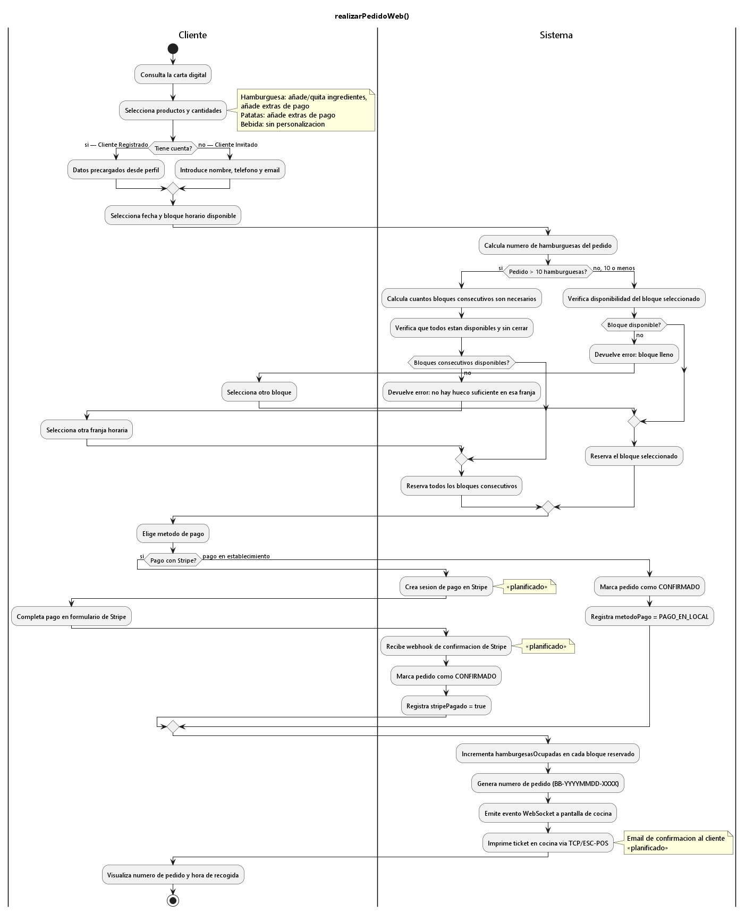
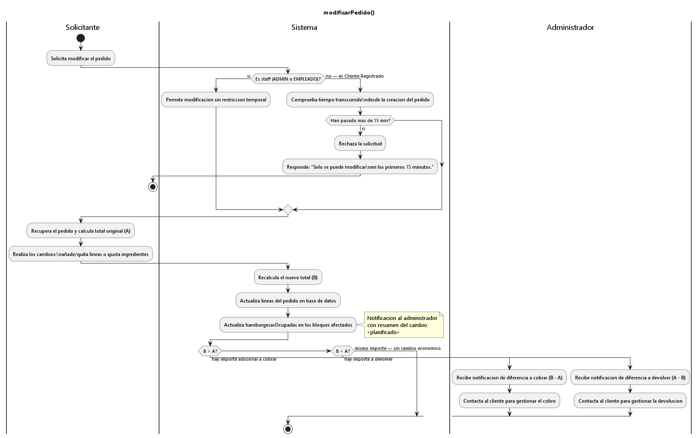
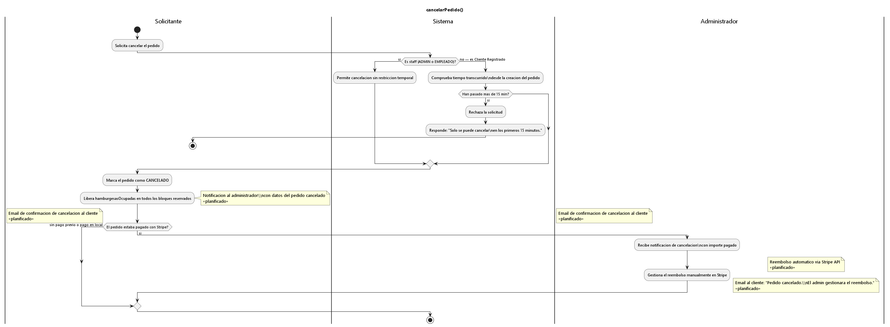
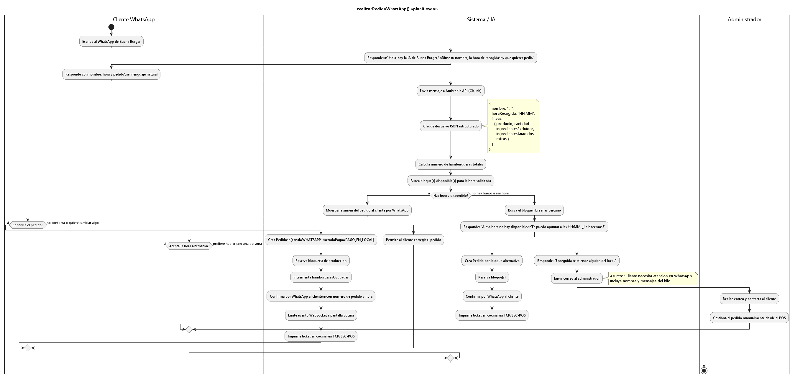

# Catálogo de casos de uso

[◄ Volver al Capítulo 2](README.md) · [README principal](../README.md)

Descripción detallada de los casos de uso del sistema (actor, descripción, precondiciones, postcondiciones y flujos). El diagrama general está en el [Capítulo 2 · §4](README.md#4-casos-de-uso).

## Priorización

| Código | Caso de uso | Actor | Prioridad |
|---|---|---|:--:|
| UC-01 | Consultar carta | ClienteRegistrado / ClienteInvitado | Media |
| UC-02 | Realizar pedido web | ClienteRegistrado / ClienteInvitado | Alta |
| UC-03 | Ver historial de pedidos | ClienteRegistrado | Media |
| UC-04 | Rehacer último pedido | ClienteRegistrado | Media |
| UC-05 | Modificar pedido | ClienteRegistrado / Staff | Media |
| UC-06 | Cancelar pedido | ClienteRegistrado / Staff | Media |
| UC-07 | Realizar pedido WhatsApp | Cliente WhatsApp | Alta |
| UC-08 | Escalar a empleado | — | Baja |
| UC-09 | Crear pedido telefónico | Empleado / Administrador | Alta |
| UC-10 | Forzar bloque lleno | Empleado / Administrador | Baja |
| UC-11 | Imprimir ticket | Sistema (automático) | Alta |
| UC-12 | Gestionar carta | Administrador | Media |
| UC-13 | Gestionar extras | Administrador | Media |
| UC-14 | Configurar bloques | Administrador | Alta |
| UC-15 | Ver estadísticas | Administrador | Media |
| UC-16 | Gestionar empleados | Administrador | Media |
| UC-17 | Cerrar día de operación | Administrador | Media |
| UC-18 | Gestionar diferencia económica | Administrador | Baja |

---

## UC-01 · Consultar Carta

| Campo | Descripción |
|---|---|
| **Actor** | ClienteRegistrado / ClienteInvitado |
| **Descripción** | La carta siempre está accesible. No hace falta tener cuenta ni que el local esté abierto. |
| **Precondiciones** | Ninguna. |
| **Postcondiciones** | El usuario ve los productos organizados por categoría y puede filtrarlos. |

**Flujo principal:**
1. El usuario entra en la web.
2. La carta aparece al pinchar en *Carta*; los productos salen ordenados y se pueden filtrar por tipo (hamburguesas, patatas, bebidas, postres).
3. Cada producto muestra sus ingredientes y su precio.
4. Al pinchar en un producto, se añade al carrito.

---

## UC-02 · Realizar Pedido Web

| Campo | Descripción |
|---|---|
| **Actor** | ClienteRegistrado / ClienteInvitado |
| **Descripción** | El cliente elige lo que quiere, lo personaliza, escoge una hora y confirma. |
| **Precondiciones** | Que haya bloques generados para la fecha deseada y un hueco disponible. |
| **Postcondiciones** | Pedido confirmado. Los bloques pierden disponibilidad. Ticket impreso en cocina. |

**Flujo principal:**
1. El cliente toca un producto en la carta.
2. Se abre un modal con los ingredientes por defecto de ese producto.
3. El cliente puede quitar o añadir ingredientes.
4. Elige la cantidad y lo añade al carrito. Repite con los artículos que desee.
5. Abre el carrito y pulsa *Hacer Pedido*.
6. Introduce nombre, teléfono y email (pre-rellenados si tiene sesión iniciada).
7. Elige la fecha entre las noches operativas disponibles más próximas.
8. Aparecen los bloques horarios libres para ese día.
9. El cliente selecciona el que desee.
10. El sistema comprueba que el bloque sigue disponible y que hay capacidad para las hamburguesas del pedido.
11. Si hay más de diez hamburguesas, se buscan bloques consecutivos libres para repartir automáticamente.
12. Elige cómo pagar: en el local o con Stripe.
13. Se crea el pedido, se reservan los bloques y el ticket sale en la impresora de cocina.
14. Al cliente le llega un correo con el resumen y la hora de recogida.

**Flujos alternativos:**
- *FA-01:* Si entre que elige la franja y confirma, otro pedido ocupa el bloque, el sistema avisa y pide elegir otra hora.
- *FA-02:* Si el volumen necesita varios bloques seguidos y no los hay, se informa; el cliente puede reducir cantidad o cambiar de horario.

**Diagrama de actividad:**

---

## UC-03 · Ver Historial de Pedidos

| Campo | Descripción |
|---|---|
| **Actor** | ClienteRegistrado |
| **Descripción** | El cliente ve todos los pedidos que ha hecho (fechas, productos, total) y puede repetir cualquiera. |
| **Precondiciones** | Tiene sesión iniciada y ha hecho al menos 1 pedido. |
| **Postcondiciones** | Ve el historial completo. Al pulsar *Rehacer*, el carrito se carga solo y va directo a elegir día y hora. |

**Flujo principal:**
1. El cliente entra en su perfil.
2. Aparece la lista de pedidos, del más reciente al más antiguo.
3. Cada entrada muestra número, fecha, artículos y total.
4. Puede expandir cualquiera para ver el detalle completo.
5. Al pulsar *Rehacer*, el sistema carga esas líneas en el carrito y lleva a la selección de fecha y hora.

**Flujos alternativos:**
- *FA-01:* Si todavía no ha hecho ningún pedido, aparece un mensaje indicándolo.

---

## UC-04 · Rehacer Pedido

| Campo | Descripción |
|---|---|
| **Actor** | ClienteRegistrado |
| **Descripción** | Desde el historial, carga en el carrito las líneas de un pedido anterior y va directo a elegir día y hora, sin pasar por la carta. |
| **Precondiciones** | Tiene sesión iniciada y al menos 1 pedido previo. |
| **Postcondiciones** | El carrito tiene las mismas líneas y personalizaciones del pedido elegido. |

**Flujo principal:**
1. El cliente localiza en su historial el pedido a repetir.
2. Pulsa *Rehacer*.
3. El sistema carga todos los productos tal cual estaban (cantidades, ingredientes excluidos y añadidos).
4. Le lleva directo a elegir fecha y hora.
5. A partir de ahí, el flujo es el de UC-02 desde el paso 7.

---

## UC-05 · Modificar Pedido

| Campo | Descripción |
|---|---|
| **Actor** | ClienteRegistrado / Staff |
| **Descripción** | Se modifican las líneas de un pedido confirmado, siempre que queden más de 15 minutos para la recogida. El cliente registrado lo hace desde su perfil; el no registrado llama al local y lo hace el staff. |
| **Precondiciones** | El pedido existe, está confirmado y quedan más de 15 minutos para la recogida. |
| **Postcondiciones** | Las líneas se actualizan. Los bloques se recalculan si cambia el número de hamburguesas. Si hay diferencia de precio, el admin recibe aviso. |

**Flujo principal (cliente registrado):**
1. El cliente localiza el pedido en su perfil.
2. El sistema comprueba que quedan más de 15 minutos; si es así, muestra la opción de modificar.
3. El cliente cambia las líneas.
4. El sistema recalcula el total y ajusta los bloques si cambia el número de hamburguesas.
5. Si el pedido estaba pagado por Stripe y cambia el precio, se notifica al administrador para resolver la diferencia.

**Flujo alternativo (cliente no registrado):** llama al local; el empleado localiza el pedido, comprueba el plazo y aplica los cambios; el sistema reajusta total y bloques y avisa al admin si hay diferencia.

**Flujos alternativos:**
- *FA-01:* Si quedan menos de 15 minutos, el sistema no permite modificar.

**Diagrama de actividad:**

---

## UC-06 · Cancelar Pedido

| Campo | Descripción |
|---|---|
| **Actor** | ClienteRegistrado / Staff |
| **Descripción** | Se cancela un pedido confirmado, siempre que queden más de 15 minutos para la recogida. |
| **Precondiciones** | El pedido existe, está confirmado y quedan más de 15 minutos. |
| **Postcondiciones** | Pedido cancelado. Bloques liberados. Si había pago por Stripe, el admin gestiona el reembolso. |

**Flujo principal (cliente registrado):**
1. El cliente localiza el pedido en su perfil.
2. El sistema comprueba el plazo; si es válido, muestra la opción de cancelar.
3. El pedido pasa a cancelado y sus bloques quedan libres.
4. Si el pago fue por Stripe, se avisa al administrador para la devolución.

**Flujo alternativo (cliente no registrado):** llama al local y el empleado cancela desde el panel; bloques liberados y, si procede, aviso al admin.

**Flujos alternativos:**
- *FA-01:* Si quedan menos de 15 minutos, no se permite cancelar, lo intente quien lo intente.

**Diagrama de actividad:**

---

## UC-07 · Realizar Pedido WhatsApp

| Campo | Descripción |
|---|---|
| **Actor principal** | Cliente WhatsApp |
| **Descripción** | El cliente escribe al WhatsApp del negocio en lenguaje natural. La IA interpreta el mensaje, comprueba hueco y registra el pedido. El pago es siempre en local. |
| **Precondiciones** | WhatsApp Business API y Anthropic API (Claude) activas. Bloques disponibles para la hora pedida. |
| **Postcondiciones** | Pedido registrado con canal WHATSAPP y pago en local. Ticket impreso en cocina. |

**Flujo principal:**
1. El cliente escribe, p. ej.: *"Quiero dos Buena Burger con extra de queso para las 21:30"*.
2. La integración con Anthropic (Claude) extrae productos, cantidades, personalizaciones, hora y día.
3. Se comprueba la disponibilidad del bloque.
4. Si hay hueco, se confirma el pedido y el sistema responde con número y hora de recogida.
5. En cocina se imprime el ticket, igual que en cualquier otro canal.

**Flujos alternativos:**
- *FA-01:* Si no hay hueco, la IA sugiere franjas cercanas.
- *FA-02:* Si el mensaje no está claro, la IA pide que se complete o aclare.
- *FA-03:* Si la conversación se complica o el cliente lo pide, un empleado toma el control del chat (UC-08).

**Diagrama de actividad:**

---

## UC-09 · Crear Pedido Telefónico

| Campo | Descripción |
|---|---|
| **Actor principal** | Empleado / Administrador |
| **Descripción** | El empleado recibe una llamada y registra el pedido en el POS interno. |
| **Precondiciones** | Sesión con rol empleado o administrador. Huecos disponibles. |
| **Postcondiciones** | Pedido registrado con canal TELEFONO y pago en local. Ticket impreso en cocina. |

**Flujo principal:**
1. El empleado abre el POS interno.
2. Introduce nombre y teléfono del cliente.
3. Selecciona productos y añade personalizaciones.
4. Elige la hora de recogida.
5. El sistema comprueba si el bloque tiene hueco.
6. Se crea el pedido y el ticket sale en cocina.
7. El empleado confirma al cliente número y hora.

**Flujos alternativos:**
- *FA-01:* Si el bloque está lleno pero se justifica, el empleado puede forzarlo (UC-10).
- *FA-02:* Si está lleno y no se fuerza, se busca otra franja con el cliente.

---

## UC-11 · Imprimir Ticket

| Campo | Descripción |
|---|---|
| **Actor principal** | Sistema (automático) |
| **Actores secundarios** | Impresora térmica, Pantalla de cocina (iPad) |
| **Descripción** | Cuando un pedido pasa a CONFIRMADO, el sistema imprime el ticket en cocina y avisa al iPad. Nadie tiene que intervenir. |
| **Precondiciones** | El pedido está confirmado. La impresora tiene IP y puerto configurados. |
| **Postcondiciones** | Ticket impreso. iPad notificado con alerta sonora y visual. |

**Flujo principal:**
1. El sistema detecta que un pedido acaba de confirmarse.
2. Prepara el contenido del ticket: número, hora de recogida, nombre y líneas con personalizaciones y extras.
3. Abre conexión TCP al puerto 9100 de la impresora y manda los comandos ESC/POS.
4. La impresora imprime el ticket.
5. A la vez, lanza el evento `nuevo-pedido` por Socket.IO al iPad de cocina.
6. El iPad suena y actualiza la lista de pedidos.

**Flujos alternativos:**
- *FA-01:* Si la impresora está apagada o sin red, el pedido entra en cola y se puede reimprimir desde el panel de administración.

---

## UC-14 · Configurar Bloques de Producción

| Campo | Descripción |
|---|---|
| **Actor principal** | Administrador |
| **Actores secundarios** | Scheduler (Cron) |
| **Descripción** | El sistema genera automáticamente los bloques de los próximos días. El administrador puede cerrar los que necesite. |
| **Precondiciones** | El servidor está en marcha. |
| **Postcondiciones** | Bloques disponibles en base de datos. Los cambios del admin se reflejan al momento para los clientes. |

**Flujo principal (generación automática):**
1. Al arrancar el servidor y cada medianoche, el scheduler genera los bloques.
2. Revisa los próximos 60 días y se queda solo con viernes, sábados y domingos.
3. Para cada noche operativa genera 30 bloques de 5 minutos entre las 20:30 y las 23:00, con un máximo de 10 hamburguesas por bloque.
4. Se guardan en MongoDB Atlas; un índice único por fecha y hora evita duplicados.

**Flujo alternativo (cierre por el administrador):**
1. El administrador entra en el panel.
2. Cierra un bloque o un día completo (vacaciones, incidencia en cocina).
3. Esos bloques pasan a cerrado.
4. Los clientes los ven como no disponibles.
5. El administrador puede reabrir cualquier bloque o día cuando quiera.

---

[◄ Volver al Capítulo 2](README.md) · [README principal](../README.md)
