# Capítulo 3 — Análisis y diseño

[◄ Volver al README principal](../README.md) · [Memoria completa del capítulo](../docs/capitulos/capitulo3.docx)

> **Disciplina:** análisis y diseño. Traduce los requisitos del Capítulo 2 en una **estructura de software**.
> **Qué se defiende aquí:** cómo el modelo del dominio se convierte en clases MVC, cómo colaboran para resolver cada caso de uso, y cómo se organiza el sistema en capas, componentes y datos.

**Recorrido:** [1. MVC (análisis)](#1-clases-de-análisis-mvc) → [2. Colaboración por caso de uso](#2-realización-de-casos-de-uso-colaboración) → [3. Arquitectura](#3-arquitectura) → [4. Modelo de datos](#4-modelo-de-datos) → [5. Clases de diseño](#5-clases-de-diseño) → [6. Secuencias de integración](#6-secuencias-de-integración)

---

## 1. Clases de análisis (MVC)

En la fase de análisis, cada caso de uso se reparte entre tres responsabilidades MVC bien diferenciadas:

- **Vista** → clases *frontera*: presentan información e **invocan** acciones (formularios, modales, pantallas).
- **Controlador** → una clase de control **por caso de uso**: orquesta el flujo y aplica las reglas.
- **Modelo** → clases *entidad* que **derivan directamente del modelo del dominio** (Cap. 2 §1).

[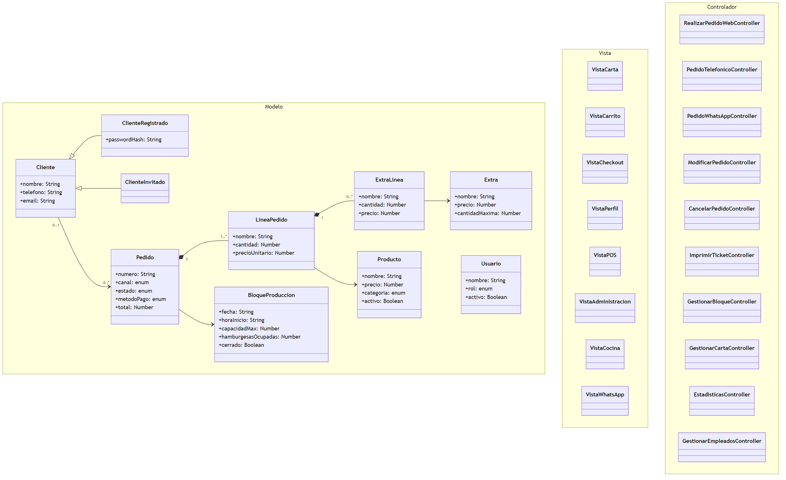](../docs/diagramas/capitulo3/06_clases_analisis_mvc.png)

**Organización en paquetes de análisis** (separación Vista / Controlador / Modelo):

[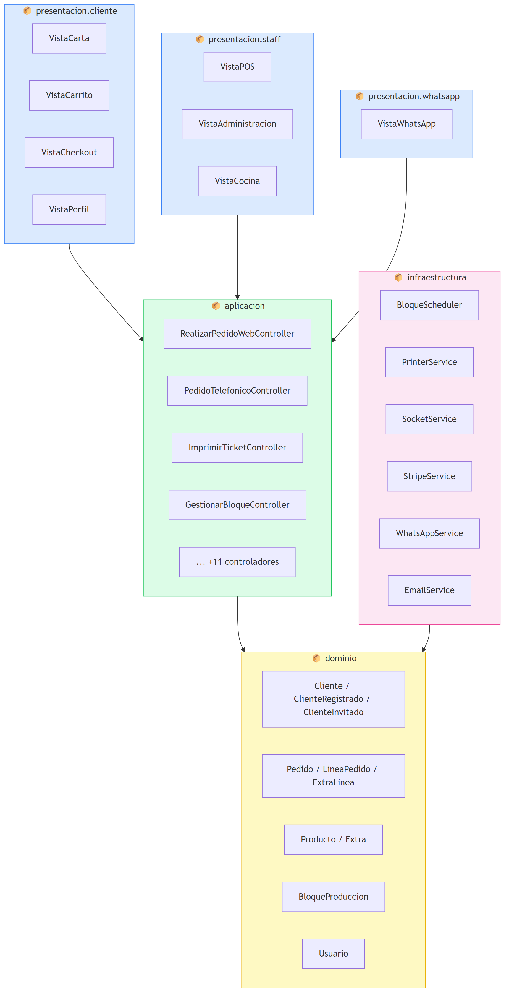](../docs/diagramas/capitulo3/07_paquetes_analisis.png)

> **Clave de defensa:** «invocar» o «presentar» van en la **Vista**; el caso de uso siempre vive en el **Controlador**; las entidades del **Modelo** son las mismas del dominio. Esta separación es la que luego se ve 1:1 en las carpetas del código (`public/` ↔ Vista, `src/controllers/` ↔ Controlador, `src/models/` ↔ Modelo).

---

## 2. Realización de casos de uso (colaboración)

Los diagramas de colaboración muestran **qué objetos intervienen y qué mensajes se intercambian** para resolver cada caso de uso de alta prioridad.

| UC-02 · Realizar pedido web | UC-09 · Pedido telefónico |
|:--:|:--:|
| [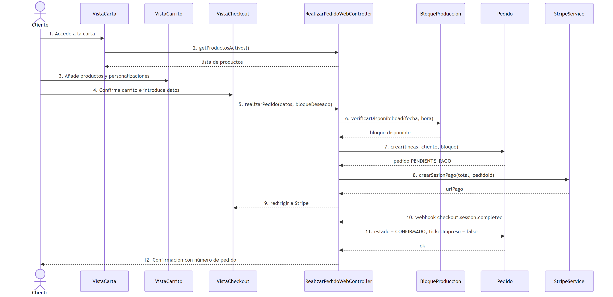](../docs/diagramas/capitulo3/02_colaboracion_uc02_pedido_web.png) | [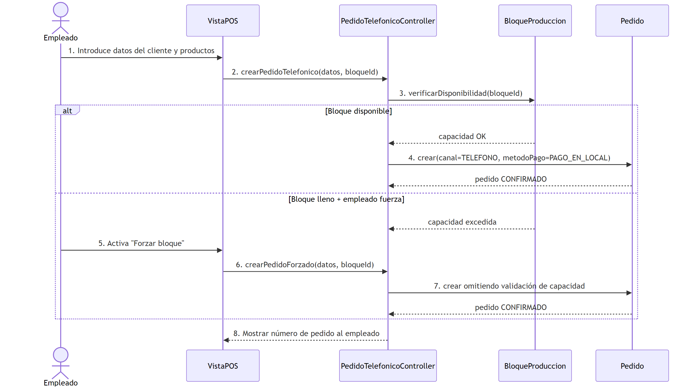](../docs/diagramas/capitulo3/03_colaboracion_uc09_pedido_telefonico.png) |

| UC-11 · Imprimir ticket | UC-14 · Bloques de producción |
|:--:|:--:|
| [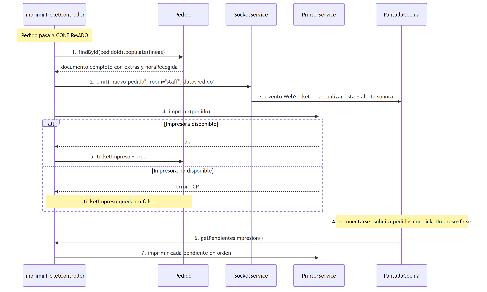](../docs/diagramas/capitulo3/04_colaboracion_uc11_imprimir_ticket.png) | [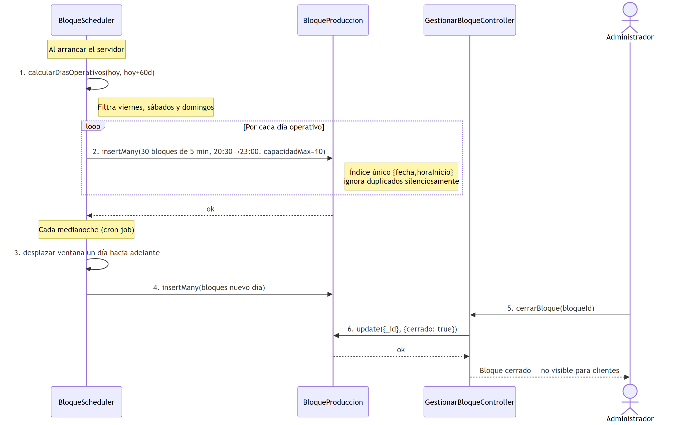](../docs/diagramas/capitulo3/05_colaboracion_uc14_bloques_produccion.png) |

---

## 3. Arquitectura

El sistema sigue una **arquitectura cliente-servidor en capas**, con API REST en el backend y frontend multipágina.

**Arquitectura en capas:**

[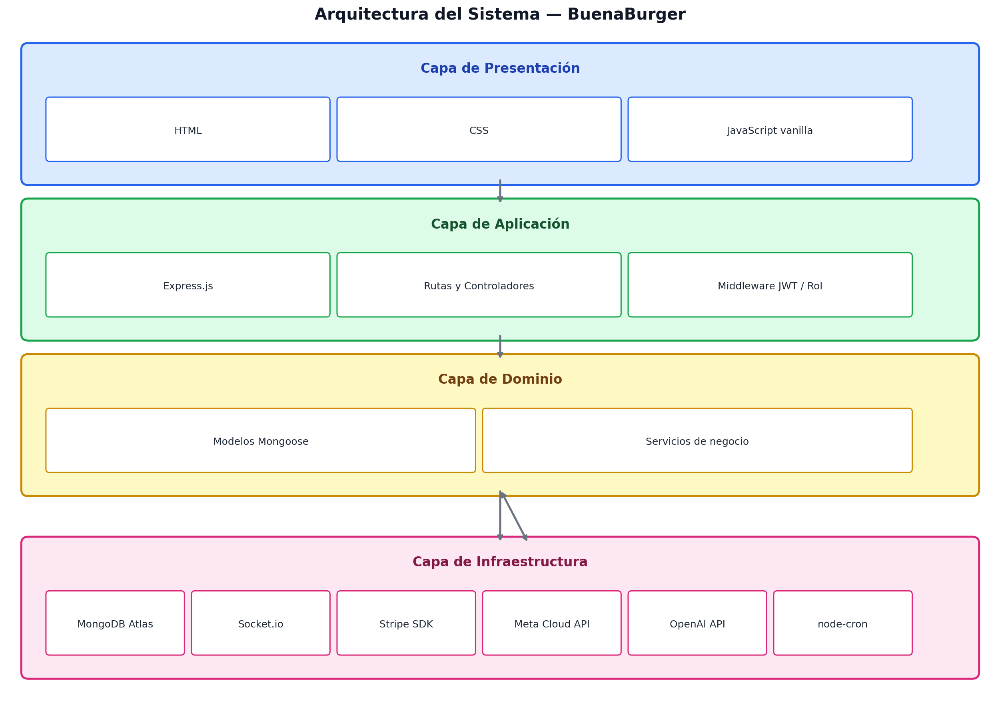](../docs/diagramas/capitulo3/01_capas_arquitectura.png)

| Diagrama de componentes | Diagrama de despliegue |
|:--:|:--:|
| [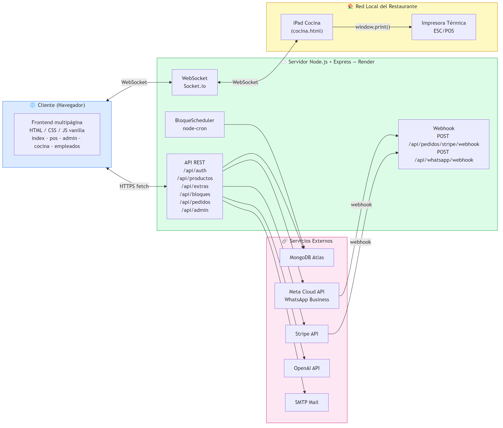](../docs/diagramas/capitulo3/08_componentes_arquitectura.png) | [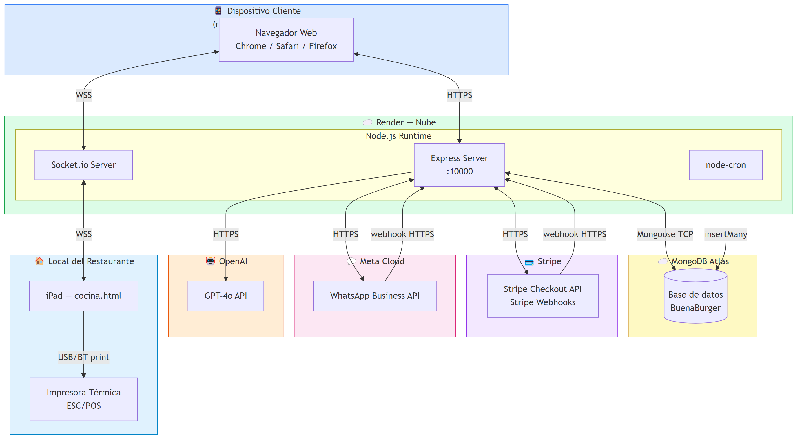](../docs/diagramas/capitulo3/09_despliegue_sistema.png) |

> El diagrama de **despliegue** refleja la doble configuración: producción (Render + MongoDB Atlas + agente en Raspberry Pi) y demostración local (un único equipo).

---

## 4. Modelo de datos

El modelo entidad-relación traduce el modelo del dominio (Cap. 2) a la estructura persistida en MongoDB Atlas. Es el origen directo de los modelos Mongoose de [`src/models/`](../src/models).

[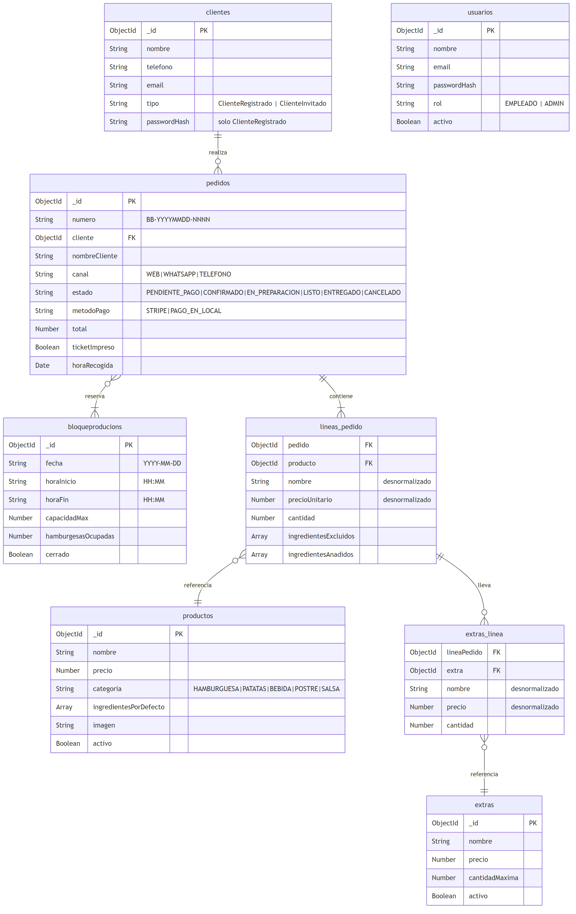](../docs/diagramas/capitulo3/10_modelo_datos_erd.png)

---

## 5. Clases de diseño

Las clases de diseño refinan las de análisis con detalle de implementación (atributos, métodos, tecnología):

[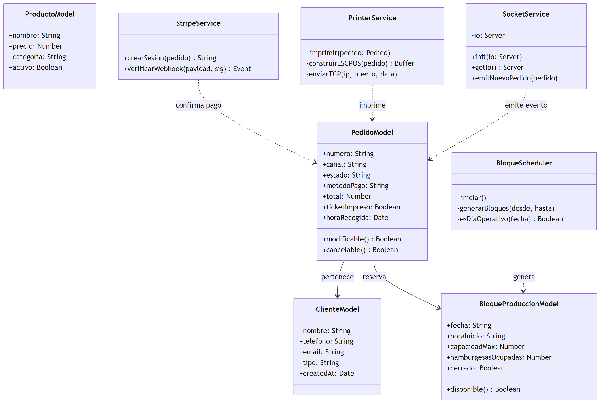](../docs/diagramas/capitulo3/11_clases_diseno.png)

---

## 6. Secuencias de integración

Secuencias de los casos de uso de mayor complejidad técnica, donde intervienen servicios externos:

| Pago con Stripe | Asistente WhatsApp (Claude) | Solución de impresión |
|:--:|:--:|:--:|
| [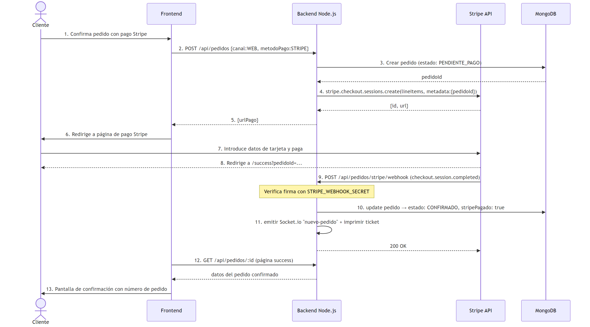](../docs/diagramas/capitulo3/12_secuencia_stripe.png) | [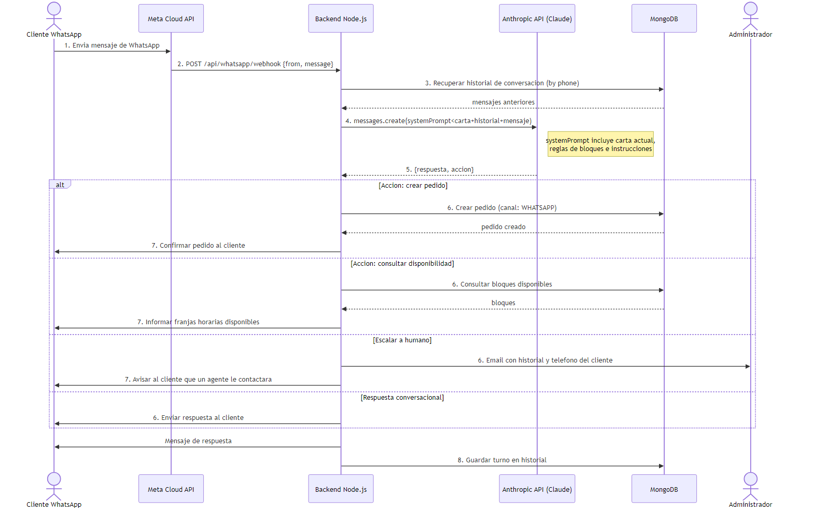](../docs/diagramas/capitulo3/13_secuencia_whatsapp.png) | [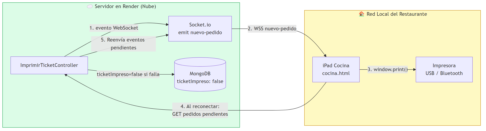](../docs/diagramas/capitulo3/14_solucion_impresion.png) |

**Prototipos de interfaz de los tres perfiles de usuario:**

---

[◄ Capítulo 2](../Capitulo_2/README.md) · [README principal](../README.md) · [Capítulo 4 — Implementación ►](../Capitulo_4/README.md)
