# Capítulo 4 — Descripción de la solución

[◄ Volver al README principal](../README.md) · [Memoria completa del capítulo](../docs/capitulos/capitulo4.md)

> **Disciplina:** construcción. Es la **solución implementada**, recorrida en el orden lógico del diagrama de contexto y navegando por los casos de uso del Capítulo 2.
> **Qué se muestra aquí:** las vistas reales, cómo se navega entre ellas, cómo se imprime y cómo se mapea todo al código.

**Recorrido:** [1. Navegación](#1-diagrama-de-navegación) → [2. Portal del cliente](#2-portal-web-del-cliente) → [3. TPV](#3-sistema-tpv--uc-09) → [4. Panel de empleados](#4-panel-de-empleados) → [5. Panel de administración](#5-panel-de-administración) → [6. Impresión](#6-solución-de-impresión-uc-11) → [7. WhatsApp IA](#7-asistente-whatsapp-con-ia-uc-07) → [8. Módulos de código](#8-vistas-y-módulos-de-código)

---

## 1. Diagrama de navegación

`index.html` es el punto de entrada universal. Desde él, según el rol, se accede al perfil de cliente o, con JWT, al panel de empleados, al de administración y al TPV.

| Interfaz | Archivo (`public/`) | Actor principal |
|---|---|---|
| Portal web del cliente | `index.html` | ClienteRegistrado / ClienteInvitado |
| Perfil del cliente | `cliente.html` | ClienteRegistrado |
| Sistema TPV | `pos.html` | Empleado / Administrador |
| Panel de empleados | `empleados.html` | Empleado / Administrador |
| Panel de administración | `admin.html` | Administrador |

---

## 2. Portal web del cliente

### Landing y carta — UC-01

El punto de entrada presenta la identidad del negocio (**PIDE AHORA** / **PANEL STAFF**) y da paso a la carta, accesible sin necesidad de cuenta. La carta se carga dinámicamente desde `GET /api/productos`.

| Landing | Carta (UC-01) |
|:--:|:--:|
| [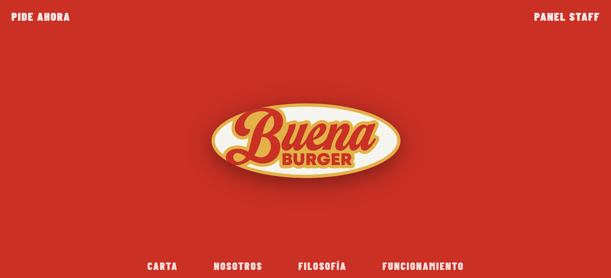](../docs/diagramas/capturas/landing.png) | [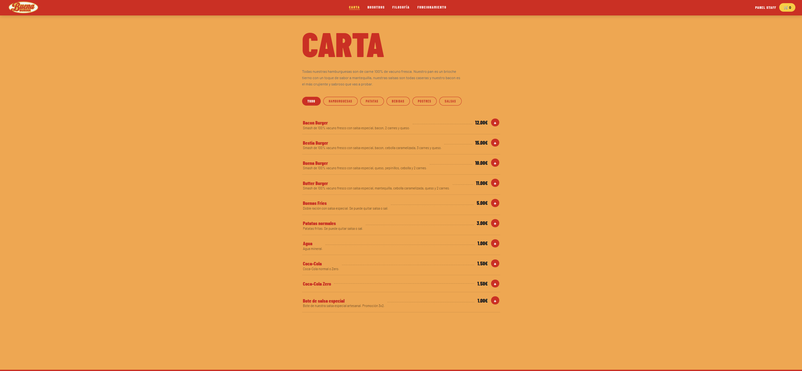](../docs/diagramas/capturas/carta.png) |

### Personalización y carrito — UC-02

Al pulsar un producto se abre el modal de personalización (quitar ingredientes, añadir salsas y extras, cantidad). El carrito flotante muestra el resumen y da paso al checkout.

| Modal de personalización | Carrito |
|:--:|:--:|
| [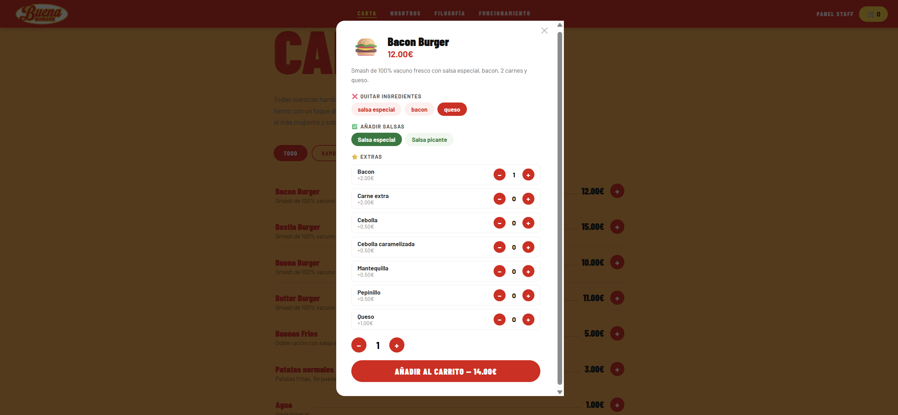](../docs/diagramas/capturas/modal_personalizacion.png) | [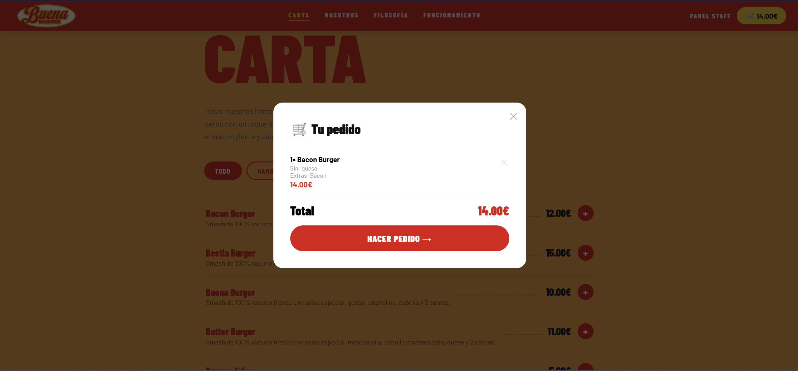](../docs/diagramas/capturas/carta_carrito.png) |

### Checkout en tres pasos — UC-02

**Datos → fecha y bloque horario → método de pago.** Al confirmar, el servidor valida que el bloque sigue libre, crea el pedido en estado `CONFIRMADO`, reserva los bloques, imprime el ticket y notifica al staff por Socket.IO.

| 1. Datos | 2. Fecha y hora | 3. Pago |
|:--:|:--:|:--:|
| [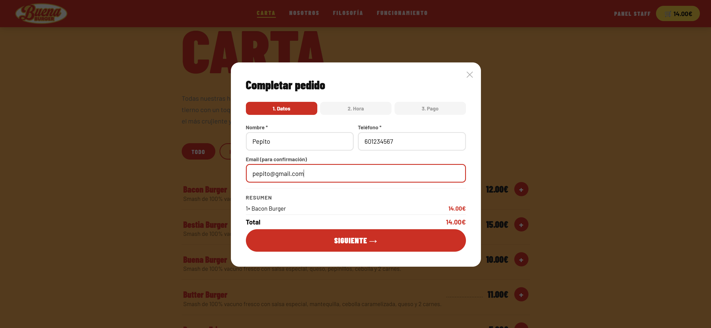](../docs/diagramas/capturas/checkout_datos.png) | [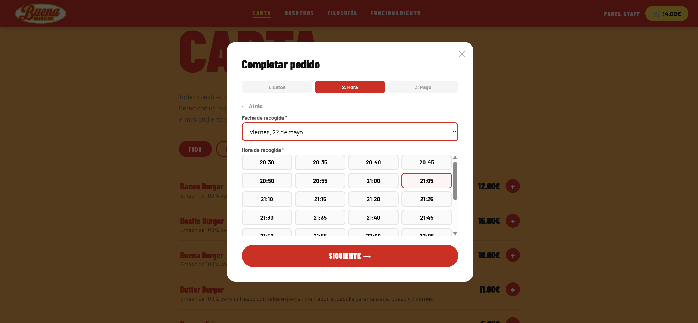](../docs/diagramas/capturas/checkout_hora.png) | [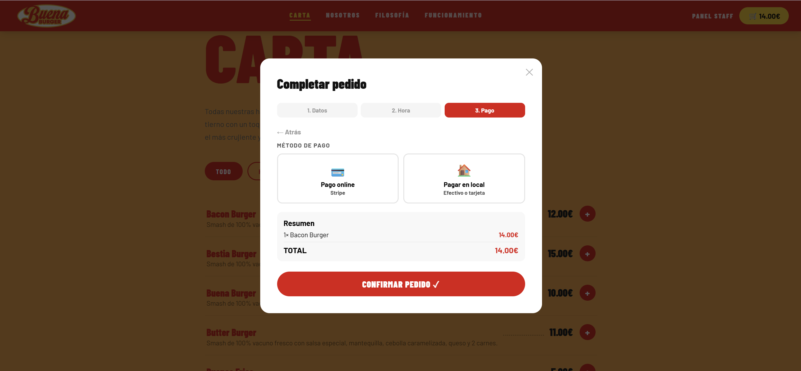](../docs/diagramas/capturas/checkout_pago.png) |

> En el paso 2, los bloques con capacidad completa aparecen como **LLENO** y no son seleccionables. Si el pedido supera 10 hamburguesas, el sistema reparte la producción en bloques consecutivos (RN-03).

### Autenticación e historial — UC-03 / UC-04

El cliente puede pedir como invitado o iniciar sesión. Los clientes registrados disponen de **Mi Perfil** con su historial y el botón **REPETIR**, que recarga el pedido en el carrito y salta directo a elegir fecha y hora.

| Inicio de sesión | Mi Perfil — historial |
|:--:|:--:|
| [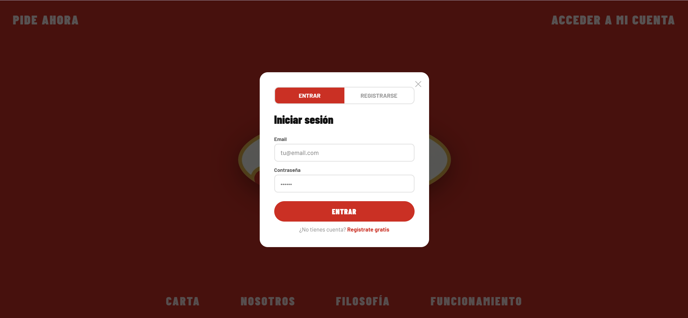](../docs/diagramas/capturas/login.png) | [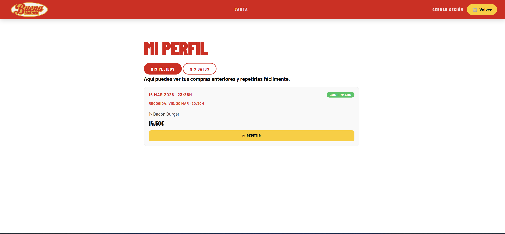](../docs/diagramas/capturas/perfil_historial.png) |

---

## 3. Sistema TPV — UC-09

El Punto de Venta (`pos.html`) está optimizado para tablet táctil: catálogo en cuadrícula a la izquierda, resumen del pedido y selector de bloque a la derecha. El pedido se crea con canal `TELEFONO` y pago en local; el empleado puede **forzar un bloque lleno** (UC-10).

[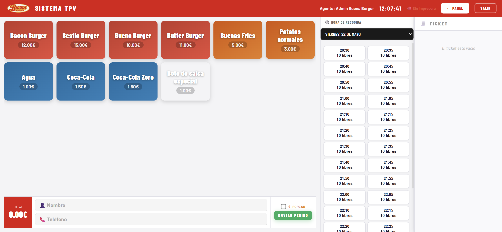](../docs/diagramas/capturas/pos.png)

---

## 4. Panel de empleados

Seguimiento operativo durante el servicio (`empleados.html`): columna de bloques del día con su ocupación (verde/amarillo/rojo) y, al seleccionar un bloque, las tarjetas de pedidos. Recibe nuevos pedidos en tiempo real por Socket.IO (`nuevo-pedido`).

[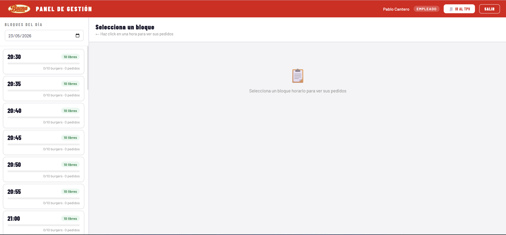](../docs/diagramas/capturas/empleados_bloques.png)

---

## 5. Panel de administración

Control completo del negocio (`admin.html`), exclusivo de rol ADMIN, en cinco pestañas.

### Pedidos y estadísticas — UC-15

| Pedidos del día (detalle) | Estadísticas del negocio |
|:--:|:--:|
| [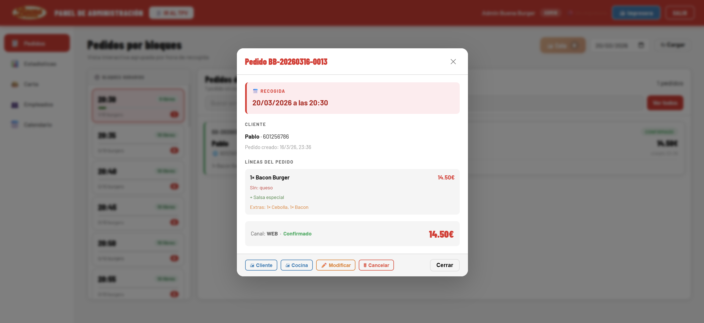](../docs/diagramas/capturas/admin_pedidos.png) | [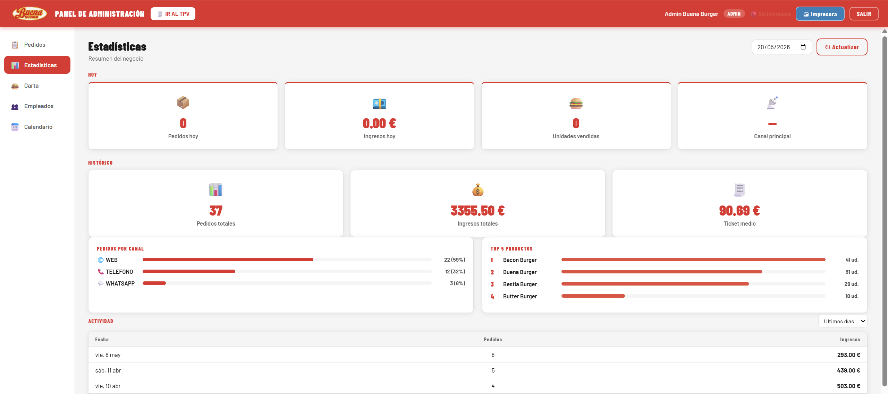](../docs/diagramas/capturas/admin_estadisticas.png) |

### Carta, empleados y calendario — UC-12/13/14/16

| Gestión de carta y extras | Gestión de empleados | Calendario de bloques (UC-14) |
|:--:|:--:|:--:|
| [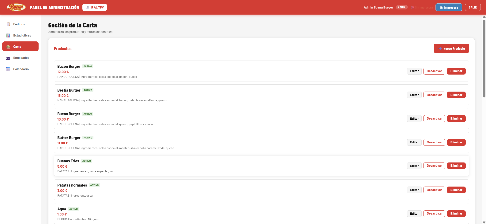](../docs/diagramas/capturas/admin_carta.png) | [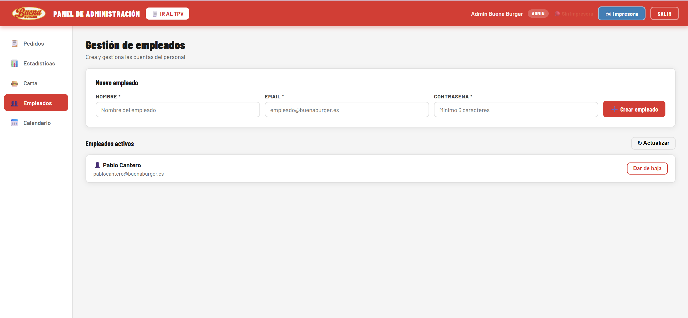](../docs/diagramas/capturas/admin_empleados.png) | [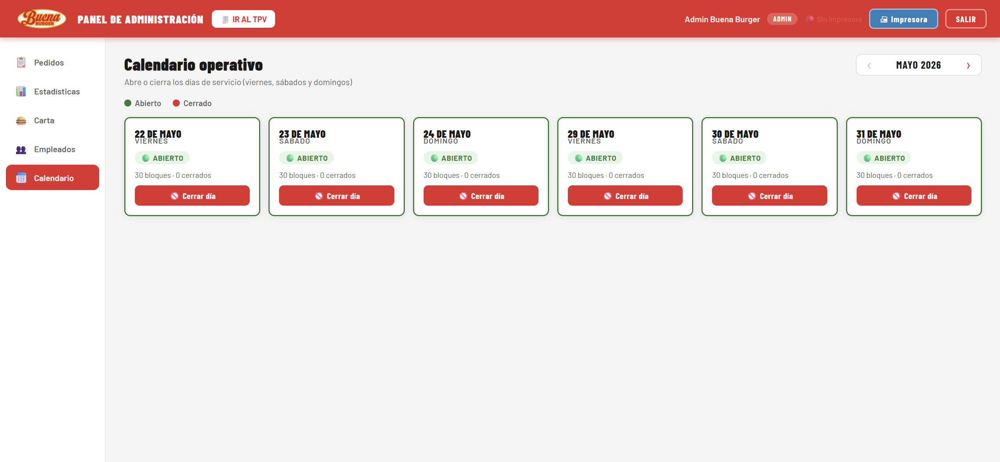](../docs/diagramas/capturas/admin_calendario.png) |

> Los cambios del calendario (cerrar un día o un bloque) se reflejan de inmediato en el portal del cliente, que deja de ofrecer los bloques cerrados.

---

## 6. Solución de impresión — UC-11

Al confirmarse un pedido, el sistema imprime el ticket en cocina y avisa al iPad. Dos modos según `PRINTER_MODE`:

- **TCP (local/demo):** el servidor conecta directo al puerto 9100 de la impresora.
- **Socket (producción):** un **agente en Raspberry Pi** mantiene un Socket.IO con el servidor en Render y recibe el ticket en base64 para imprimirlo en la red local. Si la impresora no responde, el ticket se encola y se reimprime desde el panel.

[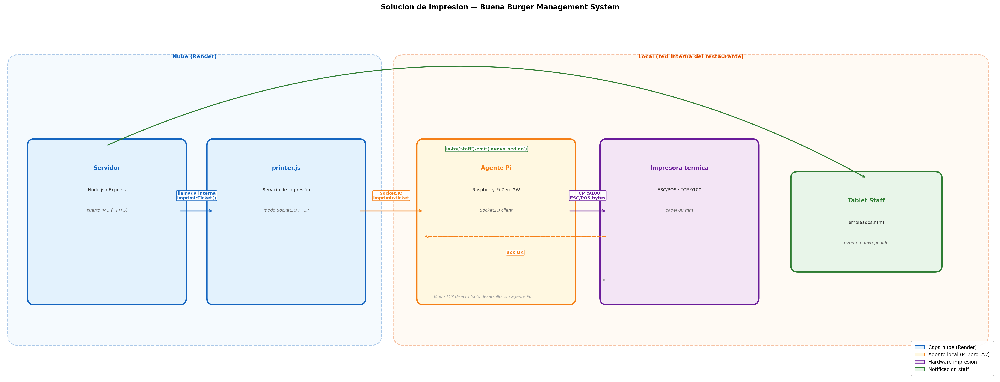](../docs/diagramas/capitulo4/02_solucion_impresion.png)

---

## 7. Asistente WhatsApp con IA — UC-07

El cliente escribe en lenguaje natural; el backend construye un *prompt* con la carta y los bloques disponibles, **Claude** extrae productos/cantidades/hora, y el servidor valida la disponibilidad antes de crear el pedido (canal `WHATSAPP`, pago en local). La lógica de IA está **encapsulada** en `src/services/ia.service.js`, de modo que el proveedor queda aislado del resto del sistema.

[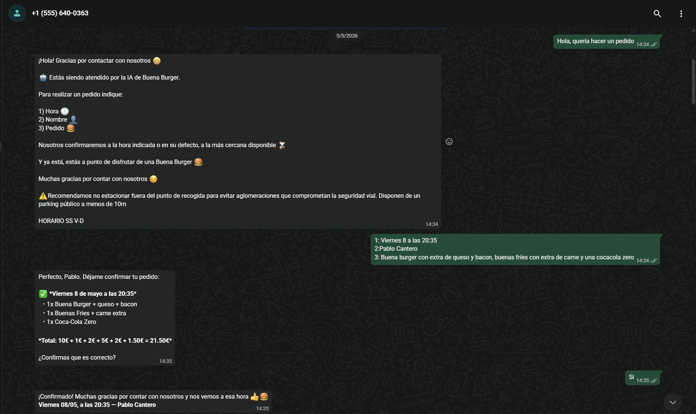](../docs/diagramas/capturas/whatsapp_chat.png)

---

## 8. Vistas y módulos de código

Cierre del hilo conductor: el diseño MVC del Capítulo 3 se materializa en estas carpetas.

| Capa | Carpeta | Contenido |
|---|---|---|
| **Vista** | [`public/`](../public) | `index`, `cliente`, `pos`, `empleados`, `admin` (HTML/CSS/JS) |
| **Controlador** | [`src/controllers/`](../src/controllers) · [`src/routes/`](../src/routes) | Un controlador por caso de uso + API REST |
| **Modelo** | [`src/models/`](../src/models) | `pedido`, `cliente`, `producto`, `extra`, `bloque`, `usuario` |
| **Servicios** | [`src/services/`](../src/services) | `bloqueScheduler`, `printer`, `socket`, `ia.service`, WhatsApp |
| **Middleware** | [`src/middleware/`](../src/middleware) | JWT, autorización por rol, validación |
| **Agente** | [`agente-impresion/`](../agente-impresion) | Cliente de impresión para Raspberry Pi |

> **Cumplimiento normativo (futuro):** la adaptación a **VERI\*FACTU** está analizada en [`docs/VERIFACTU.md`](../docs/VERIFACTU.md) y en el [Capítulo 5](../Capitulo_5/README.md#511-adaptación-al-reglamento-verifactu-prioridad-alta).

---

[◄ Capítulo 3](../Capitulo_3/README.md) · [README principal](../README.md) · [Capítulo 5 — Evaluación ►](../Capitulo_5/README.md)
