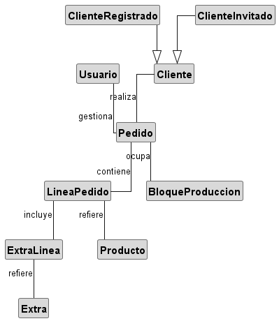
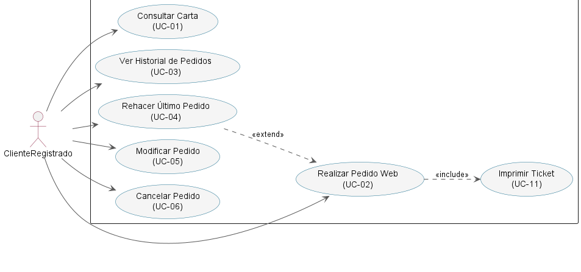
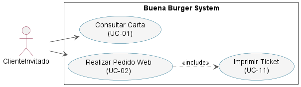
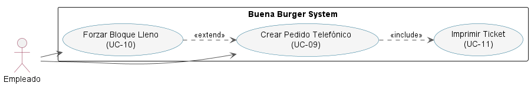
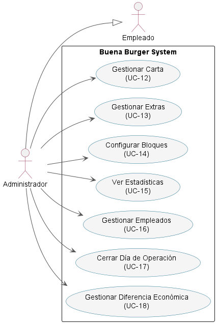
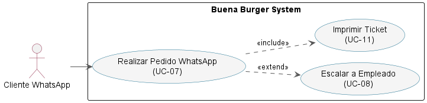
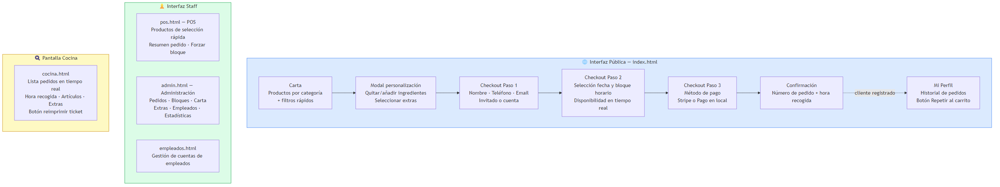
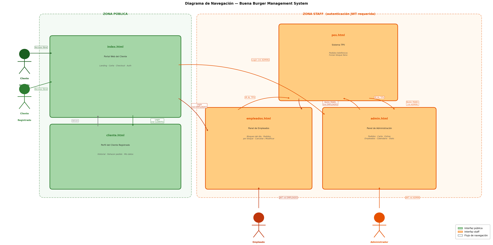

# Buena Burger Management System

### Sistema web de gestión integral de pedidos *take away* con bloques de producción y asistente de IA

**Trabajo Fin de Grado en Ingeniería Informática**
Pablo Cantero · Universidad Europea del Atlántico · 2026

---

## 1. El problema

Buena Burger es una hamburguesería artesanal *smash* de Oruña de Piélagos (Cantabria). Opera **solo en *take away*, viernes, sábado y domingo de 20:30 a 23:00**, atendiendo **50–80 pedidos por noche** con un equipo de 4 personas. La gestión es **manual**: una persona dedicada en exclusiva a teléfono y WhatsApp, y comandas escritas a mano.

Cuatro problemas derivan de ese modelo:

- **Errores en la toma de pedidos** → producto mal preparado, pérdida de materia prima y de cliente.
- **Coste laboral** de una persona dedicada solo a recibir pedidos (en una operación de 7,5 h/semana).
- **Sin trazabilidad**: no hay historial digital, ni datos para decidir.
- **Cuellos de botella en producción**: sin control de capacidad por franjas, los picos saturan la cocina y rompen la puntualidad —el valor central del negocio.

---

## 2. Propuesta de solución

Una aplicación web de **gestión integral de pedidos multicanal** con cinco piezas:

1. **Web de pedidos** anticipados con selección de hora y pago (Stripe o en local).
2. **Asistente de WhatsApp con IA** (Claude) que interpreta lenguaje natural y crea pedidos.
3. **TPV** para pedidos telefónicos y presenciales.
4. **Sistema de bloques de producción** (5 min, 10 hamburguesas/bloque) — el núcleo diferencial.
5. **Panel de administración** con estadísticas, carta, empleados y calendario.

---

## 3. Modelo del dominio

---

## 4. Diagrama de contexto

---

## 5. Casos de uso por actor

### ClienteRegistrado

### ClienteInvitado

### Empleado

### Administrador

### Cliente WhatsApp

---

## 6. Modelo–Vista–Controlador

---

## 7. Arquitectura

---

## 8. Interfaces del sistema

### Prototipos de interfaz — los tres perfiles de usuario

### Diagrama de navegación

---

## 9. Validación — una parte del sistema ya está en producción

La propuesta de solución **se valida en la práctica**: la recepción de pedidos se automatiza vía web y WhatsApp con IA, los errores de las comandas a mano desaparecen (cada pedido queda registrado y validado por el servidor), el sistema de bloques controla la capacidad de cocina en tiempo real, y el canal telefónico se mantiene guiado por el TPV.

La validación se apoyó en dos vías complementarias:

1. **Sprint Reviews con el propietario** de Buena Burger como *Product Owner*, verificando sobre datos reales los flujos de los casos de uso de mayor prioridad en cada incremento.
2. **Despliegue real de `buenaburger-pos-v1`** —el núcleo de TPV y lógica de bloques de producción—, que **lleva en uso en el local gestionando los pedidos de cada noche de servicio**. Es la evidencia de validación más sólida: ha permitido detectar y corregir, bajo carga y uso reales, comportamientos no previstos en el análisis inicial.

Esta validación en producción es la respuesta a la ausencia de una suite de pruebas automatizadas: el núcleo crítico se ha probado en condiciones reales de servicio, no solo en entorno de desarrollo.

---

## 10. Discusión de resultados

- **Bloques de producción como diferencial:** formaliza matemáticamente lo que antes era intuición del empleado. Generación automática por cron (60 días) en lugar de a demanda → mejor respuesta y menos contención de escritura.
- **Frontend sin framework:** cero dependencias y carga inmediata, a cambio de gestionar el estado manualmente. Sostenible para un equipo sin experiencia en frameworks.
- **NoSQL para pedidos personalizables:** el esquema documental simplifica las líneas con personalizaciones variables; coste: agregaciones complejas para estadísticas.
- **Encapsulación del proveedor de IA:** toda la lógica en `ia.service.js`; el proveedor puede sustituirse sin tocar la arquitectura.

---

## 11. Futuras líneas de actuación

**Adaptación al reglamento VERI\*FACTU (prioridad alta).** Obligatorio para software de facturación (RD 1007/2023, Orden HAC/1177/2024; plazos prorrogados a 2027). Requiere numeración inalterable, hash SHA-256 encadenado, imposibilidad de borrado, QR en cada ticket y comunicación con la AEAT.

| Línea | Prioridad |
|---|:--:|
| Adaptación VERI\*FACTU | Alta |
| Notificaciones push / SMS | Media |
| App móvil nativa | Media |
| Fidelización | Baja |
| Integración con inventario | Baja |
| Analítica y predicción de demanda | Baja |

---

### Ha sido un placer. Muchas gracias al tribunal por su atención.

