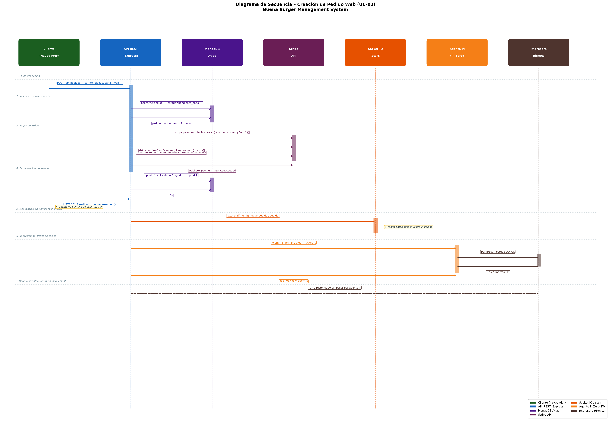

<div align="center">

# Buena Burger

### Sistema web de gestión integral de pedidos *take away* con bloques de producción y asistente de IA

Trabajo Fin de Grado en Ingeniería Informática<br>
**Pablo Cantero · Universidad Europea del Atlántico · 2026**

[](docs/capitulos/capitulo1.md)
[](#funcionalidad)
[-8B1E3F?style=for-the-badge)](docs/diagramas/capitulo3/13_secuencia_whatsapp.png)
[](docs/DEPLOY.md)

</div>

## Proyecto

Buena Burger digitaliza la toma y la gestión de pedidos *take away* de una hamburguesería artesanal de Oruña de Piélagos (Cantabria) que opera viernes, sábado y domingo. La aplicación combina una web pública de pedidos, un asistente de WhatsApp conectado a Claude (Anthropic), un panel de empleados (POS), un panel de administración, una API Node.js/Express, persistencia MongoDB Atlas y notificación en tiempo real a cocina.

La decisión principal del sistema es separar la conversación de la integridad:

> La inteligencia artificial y la web ayudan a recoger el pedido; el servidor valida los precios, comprueba la capacidad y reserva los bloques de producción.

```text
Cliente
-> web, WhatsApp con IA o teléfono/POS
-> reglas de negocio (precios + bloques de 5 min)
-> MongoDB Atlas
-> cocina (Socket.io) e impresión ESC/POS
```

## Índice general

### [Capítulo 1. Introducción, motivación y objetivos](docs/capitulos/capitulo1.md)

- [Contexto de la aplicación](docs/CONTEXTO.md)
- [Carta del negocio](docs/carta.md)

### [Capítulo 2. Análisis y requisitos](docs/capitulos/capitulo2.md)

- [Modelo del dominio](docs/modeloDelDominio.md)
- [Proceso de requisitos](docs/ProcesoRequisitos.md)
- [Diagrama de casos de uso](docs/diagramas/capitulo2/03-casos-uso.html)
- [Diagrama de estados del pedido](docs/diagramas/capitulo2/12-estados.html)
- [Secuencia — Pedido web](docs/diagramas/capitulo2/04-pedido-web.html) · [WhatsApp](docs/diagramas/capitulo2/05-pedido-whatsapp.html) · [Teléfono](docs/diagramas/capitulo2/08-telefonico.html)
- [Reserva de bloques](docs/diagramas/capitulo2/10-bloques.html)

### [Capítulo 3. Análisis y diseño](docs/capitulos/capitulo3.docx)

- Arquitectura, clases de análisis y diseño, modelo de datos (ERD) y secuencias (Stripe, WhatsApp) → ver [Diagramas principales](#diagramas-principales)

### [Capítulo 4. Implementación y solución](docs/capitulos/capitulo4.md)

- Diagrama de navegación, secuencia detallada del pedido web y solución de impresión → ver [Diagramas principales](#diagramas-principales)
- [Cumplimiento VERI*FACTU](docs/VERIFACTU.md)
- [Guía de arranque](docs/ARRANQUE.md) · [Guía de despliegue](docs/DEPLOY.md)

### [Capítulo 5. Evaluación y conclusiones](docs/capitulos/capitulo5.md)

## Diagramas principales

| Diagrama de componentes | Despliegue del sistema |
| :---: | :---: |
| [](docs/diagramas/capitulo3/08_componentes_arquitectura.png) | [](docs/diagramas/capitulo3/09_despliegue_sistema.png) |

| Sistema de bloques de producción (UC-14) | Asistente de WhatsApp con IA (Claude) |
| :---: | :---: |
| [](docs/diagramas/capitulo3/05_colaboracion_uc14_bloques_produccion.png) | [](docs/diagramas/capitulo3/13_secuencia_whatsapp.png) |

| Pago con Stripe | Solución de impresión |
| :---: | :---: |
| [](docs/diagramas/capitulo3/12_secuencia_stripe.png) | [](docs/diagramas/capitulo4/02_solucion_impresion.png) |

| Modelo de datos (ERD) | Clases de diseño |
| :---: | :---: |
| [](docs/diagramas/capitulo3/10_modelo_datos_erd.png) | [](docs/diagramas/capitulo3/11_clases_diseno.png) |

| Clases de análisis (MVC) | Diagrama de navegación |
| :---: | :---: |
| [](docs/diagramas/capitulo3/06_clases_analisis_mvc.png) | [](docs/diagramas/capitulo4/01_diagrama_navegacion.png) |

| Colaboración — Pedido web (UC-02) | Colaboración — Imprimir ticket (UC-11) |
| :---: | :---: |
| [](docs/diagramas/capitulo3/02_colaboracion_uc02_pedido_web.png) | [](docs/diagramas/capitulo3/04_colaboracion_uc11_imprimir_ticket.png) |

| Secuencia detallada del pedido web | Paquetes de análisis |
| :---: | :---: |
| [](docs/diagramas/capitulo4/03_secuencia_pedido_web.png) | [](docs/diagramas/capitulo3/07_paquetes_analisis.png) |

### Documentación y diagramas interactivos

Los diagramas del Capítulo 2 son interactivos (se abren en el navegador), por lo que se enlazan en lugar de incrustarse:

- [Modelo del dominio](docs/modeloDelDominio.md) · [Proceso de requisitos](docs/ProcesoRequisitos.md)
- [Casos de uso](docs/diagramas/capitulo2/03-casos-uso.html) · [Estados del pedido](docs/diagramas/capitulo2/12-estados.html)
- Secuencias: [Pedido web](docs/diagramas/capitulo2/04-pedido-web.html) · [WhatsApp](docs/diagramas/capitulo2/05-pedido-whatsapp.html) · [Teléfono](docs/diagramas/capitulo2/08-telefonico.html) · [Reserva de bloques](docs/diagramas/capitulo2/10-bloques.html)

## Solución

| Carta y carrito | Prototipos de interfaz | Solución de impresión |
| --- | --- | --- |
| [](docs/diagramas/capturas/carta_carrito.png) | [](docs/diagramas/capitulo3/15_interfaces_usuario.png) | [](docs/diagramas/capitulo4/02_solucion_impresion.png) |

### Funcionalidad

- Pedidos por tres canales: web pública, WhatsApp con IA (Claude) y teléfono/POS.
- Sistema de bloques de producción de 5 min (capacidad de 10 hamburguesas por bloque) con reserva automática de bloques consecutivos para pedidos grandes.
- Validación de precios y capacidad en el servidor: el cliente nunca fija el total ni el precio de las líneas.
- Generación automática de bloques con `node-cron` para los próximos 60 días.
- Pago en el local o con Stripe mediante webhook firmado.
- Impresión de tickets ESC/POS (cliente y cocina) a través de un agente en Raspberry Pi.
- Notificación en tiempo real a cocina con Socket.io.
- Panel de administración: estadísticas, empleados, carta, calendario y reimpresión de tickets.
- Modificación y cancelación de pedidos dentro de los primeros 15 minutos.

## Arquitectura

<div align="center">

[](docs/diagramas/capitulo3/01_capas_arquitectura.png)

</div>

> **Arquitectura de producción.** El sistema en explotación funciona desplegado en **Render**, con **MongoDB Atlas** y un **agente en Raspberry Pi** que imprime en la red local del negocio. Esta es la configuración que se usa actualmente y la prevista a futuro.
>
> **Demostración ante el tribunal.** La defensa se realiza ejecutando todo **en local sobre un único equipo** (sin Render y sin la Raspberry Pi), tal como se describe en [Ejecución en local](#ejecución-en-local-demostración). Es el mismo código; solo cambia dónde se ejecuta y el transporte de impresión.

| Área | Tecnología |
| --- | --- |
| Frontend | HTML, CSS y JavaScript vanilla (SPA modular) |
| Backend | Node.js, Express 4 |
| Persistencia | MongoDB Atlas, Mongoose |
| Tiempo real | Socket.io |
| Seguridad | JWT, bcrypt, Helmet, CORS, express-rate-limit, express-validator |
| Pagos | Stripe |
| IA y mensajería | Claude (Anthropic) + Meta Cloud API (WhatsApp) |
| Impresión | ESC/POS por TCP + agente en Raspberry Pi |

## Ejecución en local (demostración)

Esta es la forma de arrancar el sistema **en un solo equipo**, que es la que se utiliza para la demostración ante el tribunal. **No requiere Render ni la Raspberry Pi.**

```bash
git clone <url-del-repositorio>
cd tfg-buenaburger-manage-system
npm install
npm start                   # http://localhost:3000
node src/seed.js --force    # datos iniciales (admin + carta de ejemplo)
```

| Servicio | Dirección |
| --- | --- |
| Web pública / API | `http://localhost:3000` |
| Panel de administración | `http://localhost:3000/admin.html` |
| Panel de empleados (POS) | `http://localhost:3000/empleados.html` |

Variables de entorno en `.env` (ver [`.env.example`](.env.example)): `MONGODB_URI`, `JWT_SECRET`, `STRIPE_*`, `WHATSAPP_*`, `ANTHROPIC_API_KEY`.

**Impresión en la demo.** En local la impresión no pasa por la Raspberry Pi: con `PRINTER_MODE=tcp` el propio servidor imprime directamente sobre la impresora de la red local. Si en la demostración no hay impresora conectada, el sistema funciona igualmente —el pedido se crea y se notifica a cocina— y la impresión simplemente se omite o queda en cola.

## Despliegue en producción

En explotación el sistema corre en **Render + MongoDB Atlas**, y la impresión la realiza el **agente de la Raspberry Pi** (`PRINTER_MODE=socket`) dentro de la red del local. El procedimiento completo está en las guías de [arranque](docs/ARRANQUE.md) y [despliegue](docs/DEPLOY.md).

## Estructura del repositorio

```text
tfg-buenaburger-manage-system/
├── src/
│   ├── config/         Conexión a MongoDB Atlas
│   ├── models/         Modelos Mongoose (pedido, cliente, producto, bloque…)
│   ├── controllers/    Lógica de negocio (pedidos, pagos, WhatsApp, admin)
│   ├── routes/         API REST
│   ├── middleware/     Autenticación JWT y validación
│   ├── services/       Bloques, impresión ESC/POS, Socket.io, IA y WhatsApp
│   ├── utils/          Constantes y helpers
│   ├── seed.js         Datos iniciales
│   └── index.js        Servidor Express + Socket.io
├── public/             Frontend: web pública, POS y panel de administración
├── agente-impresion/   Agente de impresión para Raspberry Pi
├── docs/               Memoria, capítulos, diagramas y guías
├── scripts/            Generación de diagramas
└── README.md
```

## Memoria académica

La memoria del TFG se organiza en cinco capítulos navegables desde [`docs/capitulos/`](docs/capitulos/capitulo1.md). Los capítulos 1 y 2 están en Markdown; los capítulos 3, 4 y 5 incluyen además su versión en Word para la entrega oficial.

---

<div align="center">

[Capítulo 1](docs/capitulos/capitulo1.md) · [Capítulo 2](docs/capitulos/capitulo2.md) · [Capítulo 3](docs/capitulos/capitulo3.docx) · [Capítulo 4](docs/capitulos/capitulo4.md) · [Capítulo 5](docs/capitulos/capitulo5.md)

</div>
