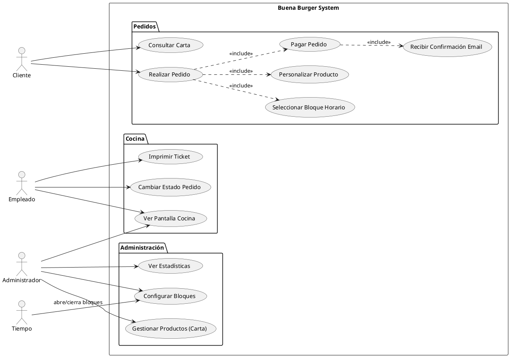
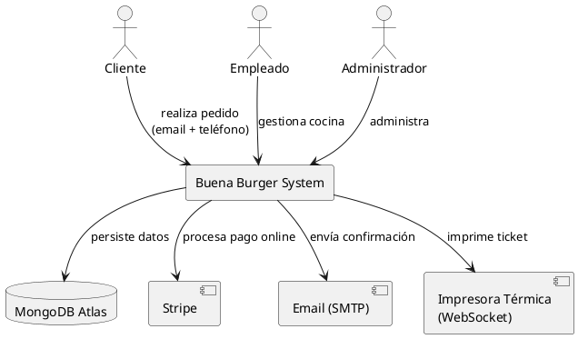
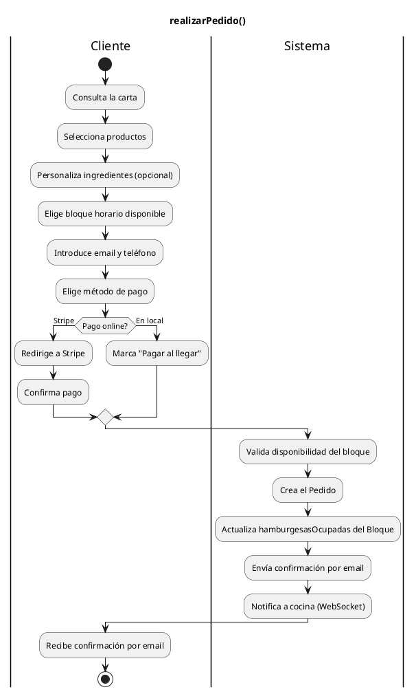
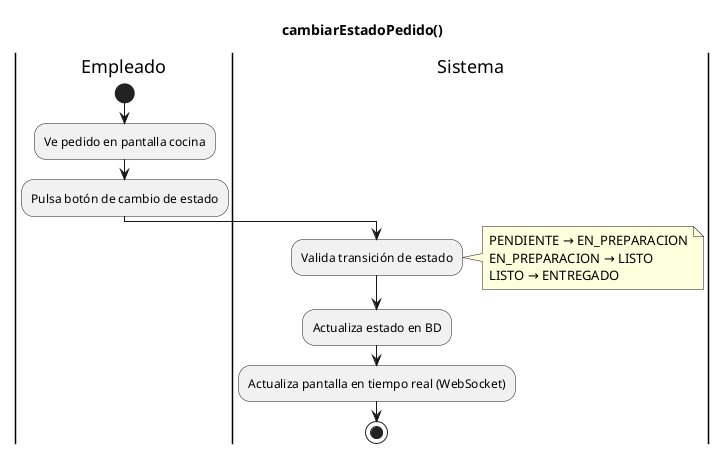
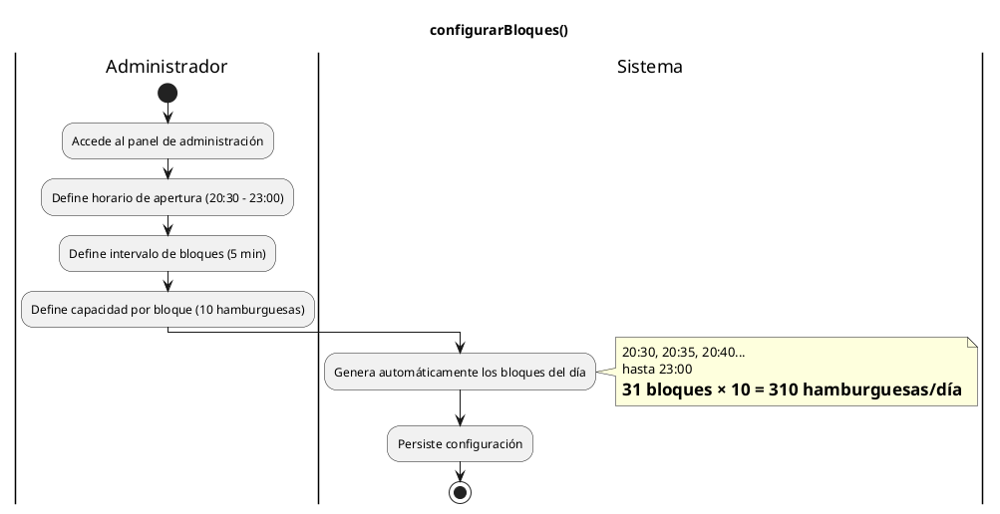

|Observar||Conceptualizar||Decidir||Construir|
|:-:|:-:|:-:|:-:|:-:|:-:|:-:|
|[Modelo del dominio](modeloDelDominio.md)|>>|[***Requisitos***](ProcesoRequisitos.md)|>>|[Análisis](ProcesoAnalisis.md)|>>|[Diseño](ProcesoDiseño.md)|

# Proceso de Requisitos: Buena Burger

Los requisitos especifican **QUÉ debe hacer el sistema** desde la perspectiva del usuario, sin contaminación de decisiones de implementación. Transforman los conceptos del dominio en comportamientos concretos del software.

## Metodología

### Punto de partida: modelo del dominio

Los requisitos parten del modelo del dominio que identificó los conceptos del mundo real:

- Pedido, LineaPedido, Producto, BloqueProduccion, Usuario

**Pregunta central:** *¿Qué solicitudes puede realizar un actor externo al sistema utilizando estos conceptos?*

### Actores

**Técnica:** Análisis de entidades externas que interactúan con el sistema

|Actor|Descripción|Justificación|
|-|-|-|
|Cliente|Persona que realiza un pedido online|Solicita consultar carta, elegir bloque, personalizar y pagar|
|Empleado|Personal del local (cocina/mostrador)|Solicita ver pedidos en tiempo real y cambiar su estado|
|Administrador|Dueño del negocio|Solicita gestionar carta, configurar bloques y ver estadísticas|
|Tiempo|Disparador temporal (cron)|Abre/cierra bloques de producción automáticamente según horario|

### Casos de Uso

**Técnica:** Análisis de objetivos que cada actor busca alcanzar

Del modelo del dominio surgen los siguientes comportamientos:

|Comportamiento identificado|¿Quién lo solicita?|
|-|:-:|
|consultarCarta()|Cliente|
|realizarPedido()|Cliente|
|seleccionarBloque()|Cliente|
|personalizarProducto()|Cliente|
|pagarPedido()|Cliente|
|recibirConfirmacion()|Cliente|
|verPantallasCocina()|Empleado|
|cambiarEstadoPedido()|Empleado|
|imprimirTicket()|Empleado|
|gestionarProductos()|Administrador|
|configurarBloques()|Administrador|
|verEstadisticas()|Administrador|
|abrirCerrarBloques()|Tiempo|

### Diagrama de Casos de Uso

*(Ver diagramas.html para visualización gráfica)*

### Diagrama de Contexto

### Detallar Casos de Uso

#### realizarPedido()

#### cambiarEstadoPedido()

#### configurarBloques()

### Prototipar Casos de Uso

Las pantallas clave del sistema son:

|Pantalla|Caso de Uso asociado|Descripción|
|-|-|-|
|Carta Digital|consultarCarta()|Grid de productos por categoría, foto y precio. Mobile-first.|
|Selector de Bloque|seleccionarBloque()|Grid de horas (20:30 a 23:00). Bloques llenos aparecen deshabilitados.|
|Checkout|realizarPedido()|Resumen del pedido, email/teléfono, método de pago.|
|Pantalla Cocina|verPantallasCocina()|Lista de pedidos activos ordenados por hora. Modo oscuro. Actualización en tiempo real.|
|Panel Admin|configurarBloques()|Configuración de horarios y capacidades.|

Los prototipos visuales se desarrollarán en la fase de diseño.
