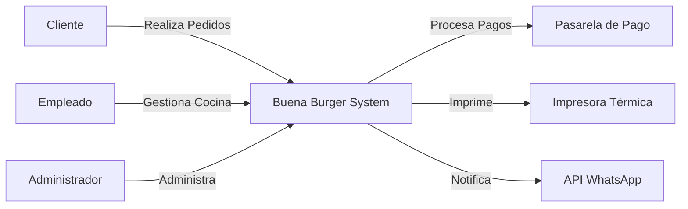
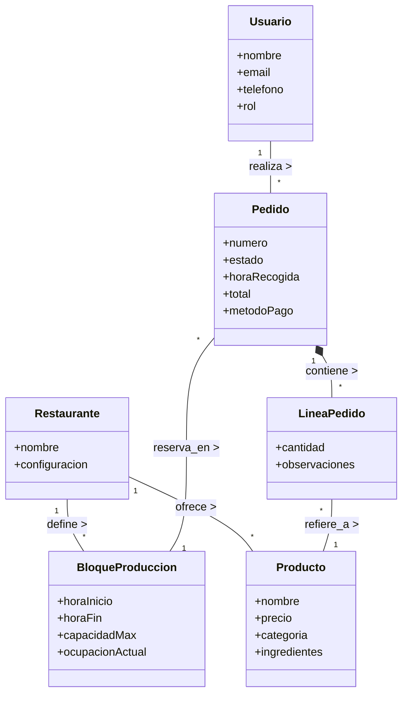

# Capítulo 2: Disciplina de Requisitos

> Según las directrices del manual *TFGs-gII*, este capítulo debe incluir: Modelo del dominio, Actores & Casos de Uso, Detalle de CdU, Prototipos y Diagrama de contexto.

## 1. Diagrama de Contexto
*Definición de los límites del sistema y su interacción con el entorno.*



---

## 2. Modelo del Dominio
*Representación visual de las entidades del negocio y sus relaciones (Diagrama de Clases Conceptual).*



### Diccionario de Datos (Entidades)
- **BloqueProduccion:** Intervalos de tiempo (ej. 15 min) que limitan cuántas hamburguesas se pueden hacer para evitar cuellos de botella en cocina.
- **Pedido:** La orden central. Estados: `Pendiente`, `Pagado`, `En Preparación`, `Listo`, `Entregado`, `Cancelado`.
- **LineaPedido:** Detalle de qué productos y cuántos.

---

## 3. Actores y Casos de Uso
*Diagrama que muestra qué puede hacer cada tipo de usuario.*

```mermaid
usecaseDiagram
    actor "Cliente" as C
    actor "Empleado" as E
    actor "Administrador (Dueño)" as A
    actor "Sistema (Cron)" as S

    package "Pedidos y Cocina" {
        usecase "Consultar Carta Digital" as UC1
        usecase "Realizar Pedido" as UC2
        usecase "Seleccionar Hora (Bloque)" as UC3
        usecase "Realizar Pago" as UC4
        
        usecase "Ver Pantalla Cocina" as UC5
        usecase "Cambiar Estado Pedido" as UC6
        usecase "Imprimir Ticket" as UC7
    }

    package "Gestión" {
        usecase "Gestionar Productos (Carta)" as UC8
        usecase "Configurar Bloques" as UC9
        usecase "Ver Estadísticas Ventas" as UC10
        usecase "Gestionar Usuarios" as UC11
    }

    %% Relaciones Cliente
    C --> UC1
    C --> UC2
    UC2 ..> UC3 : include
    UC2 ..> UC4 : include

    %% Relaciones Empleado
    E --> UC5
    E --> UC6
    E --> UC7

    %% Relaciones Admin (Hereda de Empleado implícitamente o tiene acceso total)
    A --> UC8
    A --> UC9
    A --> UC10
    A --> UC11
    A --> UC5 : también puede

    %% Sistema Automatico
    S --> UC6 : auto-cierra bloques
```

### Descripción de Casos de Uso Principales

#### **CU-02: Realizar Pedido**
Permite al cliente seleccionar productos, elegir una hora de recogida disponible (validando contra el Bloque de Producción) y pagar.

#### **CU-05: Ver Pantalla Cocina**
Muestra en tiempo real los pedidos entrantes. Se actualiza vía WebSocket. Permite a los cocineros ver qué deben preparar sin refrescar la página.

#### **CU-09: Configurar Bloques**
El administrador define la capacidad de la cocina. Ej: "Los viernes de 21:00 a 22:00 solo podemos hacer 20 hamburguesas cada 15 min".

---

## 4. Prototipos de Interfaz (Bocetos)
*(Se desarrollarán wireframes visuales posteriormente, aquí se listan las pantallas clave)*
- **P-01 Carta/Home:** Diseño limpio, fotos grandes, botón flotante de carrito.
- **P-02 Selector de Hora:** Grid de bloques. Bloques llenos aparecen deshabilitados (rojo/gris).
- **P-03 Cocina:** Modo oscuro, tarjetas de pedido grandes, botones de acción rápida.
